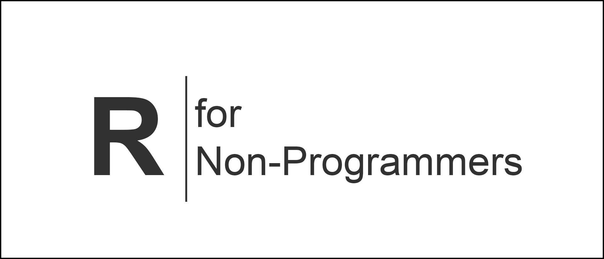

# Welcome 👋 {.unnumbered}

Welcome to *R for Non-Programmers: A guide for Social Scientists*. This book is intended to be of help to everyone who wishes to enter the world of R Programming, but not necessarily for the purpose to become a programmer. Instead, this book intends to convey key concepts in data analysis, especially quantitative research.

[Add more]
