# (PART) Getting started {.unnumbered}

# Setting up *R* and RStudio {#setting-up-r-and-rstudio}

Every journey starts with gathering the right equipment. This intellectual journey is not much different. The first step that every *R* novice has to face is to set everything up to get started. There are essentially two strategies:

-   Install [*R*](https://www.r-project.org "R"){target="_blank"} and [RStudio](https://www.rstudio.com "RStudio"){target="_blank"}

or

-   Run RStudio in a browser via [RStudio Cloud](https://rstudio.cloud "RStudio Cloud"){target="_blank"}

While installing *R* and RStudio requires more time and effort, I strongly recommend it, especially if you want to work offline or make good use of your computer's CPU. However, if you are unsure whether you enjoy learning *R*, you might wish to look at RStudio Cloud first. Either way, you can follow the examples of this book no matter which choice you make.

## Installing R {#installing-r}

The core module of our programming is *R* itself, and since it is an open-source project, it is available for free on Windows, Mac and Linux computers. So, here is what you need to do to install it properly on your computer of choice:

1.  Go to [www.r-project.org](https://www.r-project.org%5D(https://www.r-project.org) "www.r-project.org"){target="_blank"}

    

2.  Click on `CRAN` where it says `Download`.

3.  Choose a server in your country (all of them work, but downloads will perform quicker if you choose your country or one that is close to where you are).

    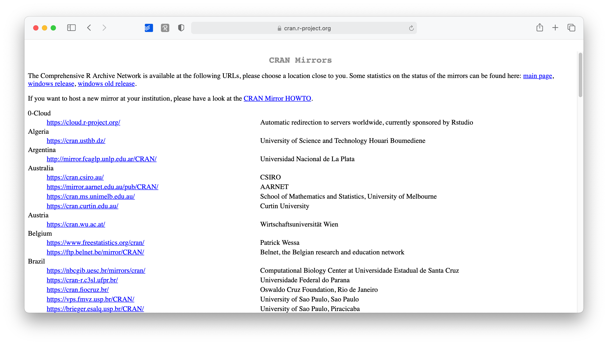

4.  Select the operating system for your computer, for example `Download R for macOS`.

    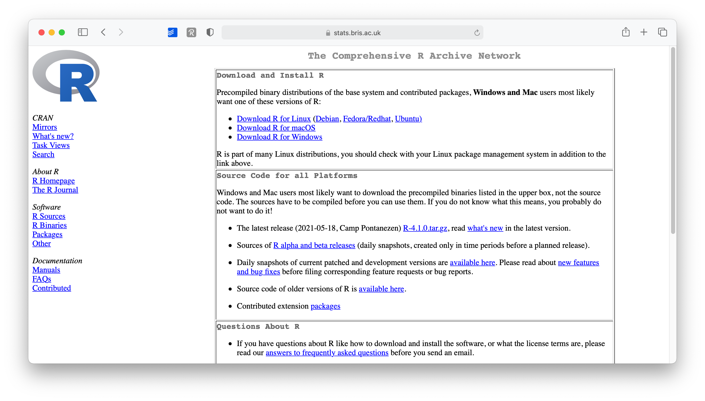

5.  Select the version you want to install (I recommend the latest version)

    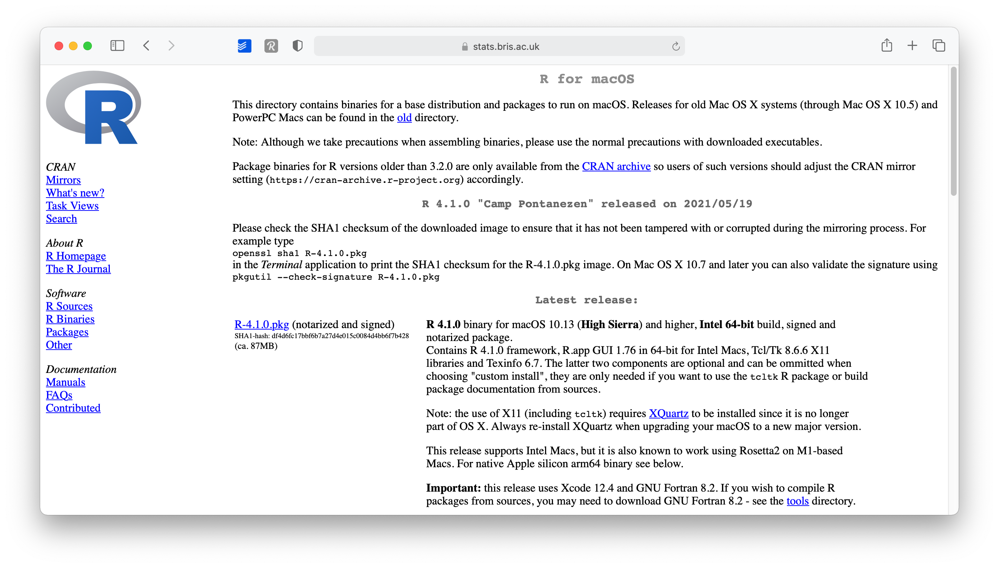

6.  Open the downloaded file and follow the installation instructions. I recommend leaving the suggested settings as they are.

This was relatively easy. You now have *R* installed. Technically you can start using *R* for your research, but there is one more tool I strongly advise installing: RStudio.

## Installing RStudio {#installing-rstudio}

*R* by itself is just the '*beating heart*' of *R* programming, but it has no particular user interface. If you want buttons to click and actually '*see*' what you are doing, there is no better way than RStudio. RStudio is an *integrated development environment* (IDE) and will be our primary tool to interact with *R*. It is the only software you need to do all the fun parts and, of course, to follow along with the examples of this book. To install RStudio perform the following steps:

1.  Go to [www.rstudio.com](https://www.rstudio.com%5D(https://www.rstudio.com) "www.rstudio.com"){target="_blank"}.

    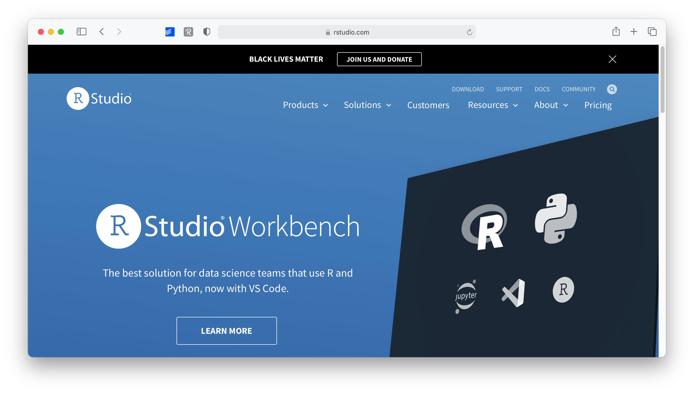

2.  Go to `Products > RStudio`.

    

3.  On this page, scroll down and select `RStudio Desktop`.

    

4.  Select the `Open Source Edition` option by clicking on `Download RStudio Desktop`.

    

5.  As a last step, scroll down where it shows you a download button for your operating system. The website will automatically detect this. You also get a nice reminder to install *R* first, in case you have not done so yet.

    

6.  Open the downloaded file and follow the installation instructions. Again, keep it to the default settings as much as possible.

Congratulations, you are all set up to learn *R*. From now on you only need to start RStudio and not *R*. Of course, if you are the curious type, nothing shall stop you to try *R* without RStudio.

## When you first start RStudio {#when-you-first-start-rstudio}

Before you start programming away, you might want to make some tweaks to your settings right away to have a better experience (in my humble opinion). I recommend at least the following two changes by clicking on `RStudio > Preferences` or press `Ctrl + ,` on a Windows computer or `⌘ + ,` if your are on a Mac.

1.  Already on the first tab, i.e. `General > Basic`, we should make one of the most significant changes. Deactivate every option that starts with `Restore`. This will ensure that every time you start RStudio, you begin with a clean slate. At first sight, it might sound counter-intuitive not to restart everything where you left off, but it is essential to make all your projects easily reproducible. Furthermore, if you work together with others, not restoring your personal settings also ensures that your programming works across different computers. Therefore, I recommend having the following unticked:

    -   `Restore most recently opened project at startup`,

    -   `Restore previsouly open source documents at startup`,

    -   `Restore .Rdata into workspace at startup`

        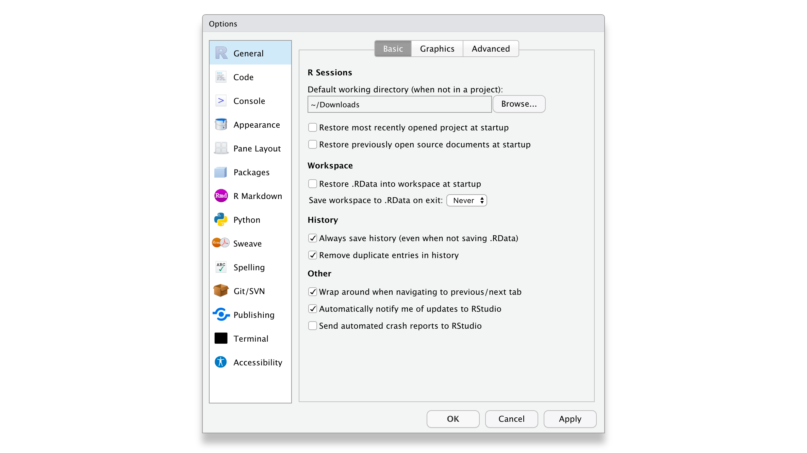

2.  In the same tab under `Workspace`, select `Never` for the setting `Save workspace to .RData on exit`. One might think it is wise to keep intermediary results stored from one R session to another. However, I often found myself fixing issues due to this lazy method, and my code became less reliable and, therefore, reproducible. With experience, you will find that this avoids many headaches you could have.

3.  In the `Code > Editing` tab, make sure to have at least the first five options ticked, especially the `Auto-indent code after paste`. This setting will save time when trying to format your coding appropriately, making it easier to read. Indentation is the primary way of making your code look more readable and less like a series of characters that appear almost random.

    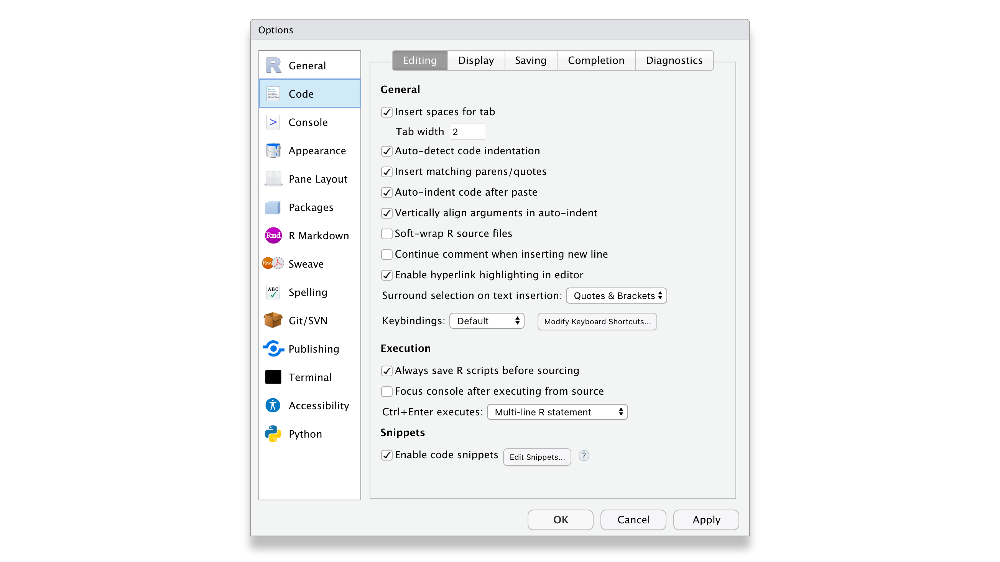

4.  In the `Display` tab, you might want to have the first three options selected. In particular, `Highlight selected line` is helpful because, in more complicated code, it is helpful to see where your cursor is.

    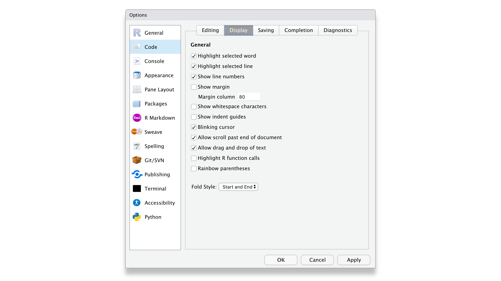

Of course, if you wish to customise your workspace further, you can do so. The visually most impactful way to alter the default appearance of RStudio is to select `Appearance` and pick a completely different colour theme. Feel free to browse through various options and see what you prefer. There is no right or wrong here. Just make it your own.

## Updating R and RStudio: Living at the pulse of innovation {#updating-r-and-rstudio}

While not strictly something that helps you become a better programmer, this advice might come in handy to avoid turning into a frustrated programmer. When you update your software, you need to update *R* and RStudio separately from each other. While both *R* and RStudio work closely with each other, they still constitute separate pieces of software. Thus, it is essential to keep in mind that updating RStudio will not automatically update R. This can become problematic if specific tools you installed via RStudio (like a fancy learning algorithm) might not be compatible with earlier versions of *R*. Also, additional *R* packages (see Chapter \@ref(r-packages)) developed by other developers are separate pieces which require updating too, independently from *R* and RStudio.

I know what you are thinking: This already sounds complicated and cumbersome. However, rest assured, we take a look at how you can easily update all your packages with RStudio. Thus, all you need to remember is: *R* needs to be updated separately from everything else.

## RStudio Cloud {#rstudio-cloud}

RStudio Cloud is an application that runs in your web browser. It allows you to write and access *R* code wherever you go. It even works on your tablet because it does not require installation. However, do expect it to run slower if your internet connection is not fast or stable. To work with RStudio Cloud, you also need an internet connection. However, there are many benefits to using RStudio in the cloud, such as running time-consuming scripts without using your own device. Also, it is much easier to collaborate with others, and since no installation is required, you can work on projects on any device as long as you are connected to the internet. However, RStudio Cloud's most significant advantage is that you can get started with programming within seconds compared to a desktop installation. Still, I prefer my locally-run offline version of RStudio, because I appreciate working offline as much as online. Nevertheless, I recommend setting up an account because you never know when you need it.

To get started with RStudio Cloud, we have to undertake a couple of steps:

1.  Open your web browser of choice and navigate to <https://rstudio.cloud>.

    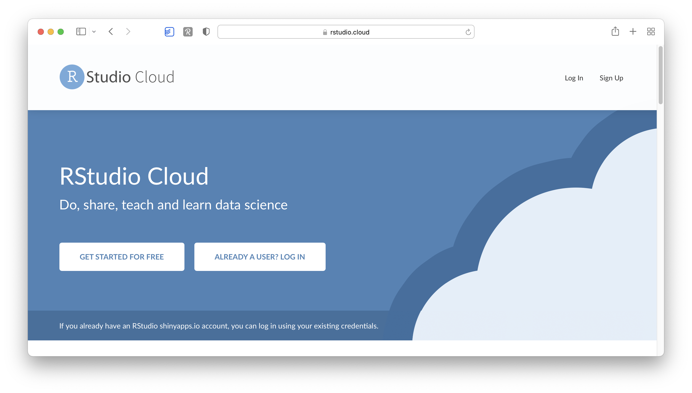

2.  Click on `Sign Up` to create your account.

3.  On the next page, make sure you have the free plan selected and click on `Sign up`.

    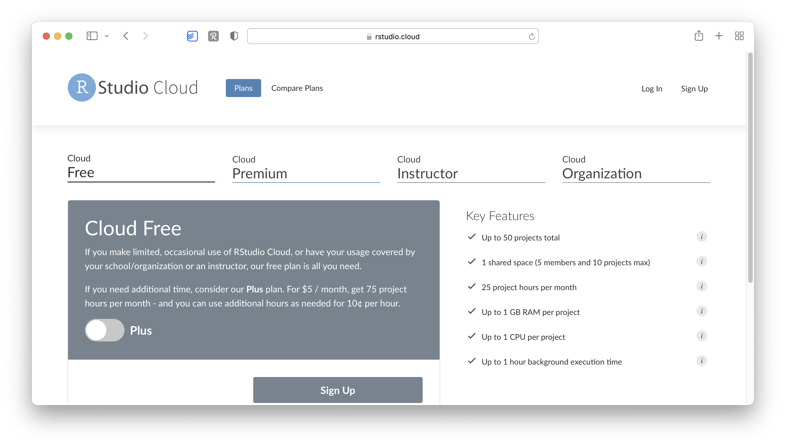

4.  To finalise the registration process, you are required to provide your credentials.

    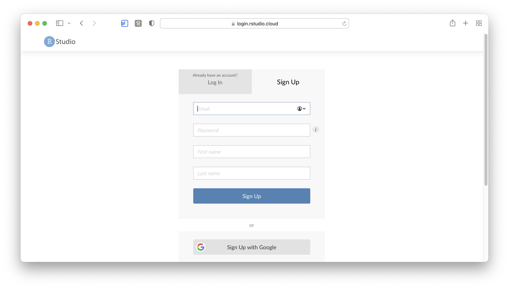

5.  Once you complete your registration, you are redirected to `Your Workspace`, the central hub for all your projects. As you can tell, I already added another workspace called `R for Non-Programmers`. However, it is fine to use the default one.

    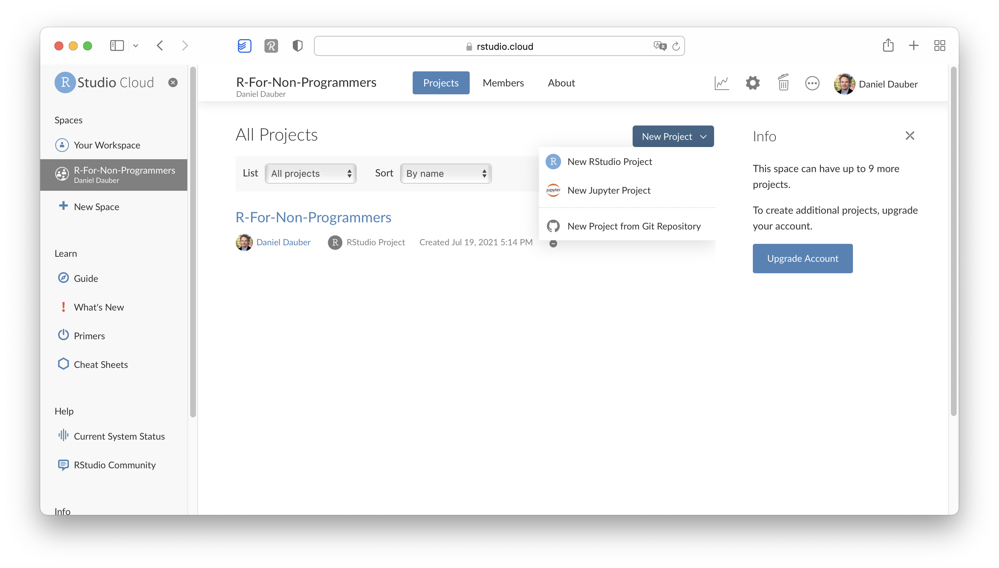

6.  To start a new *R* project, you can click on `New Project > New RStudio Project`. This will open RStudio in the Cloud, which looks identical to the desktop version. You can immediately start writing your code. The example below computes a plot.[^setting_up_r_rstudio-1]

    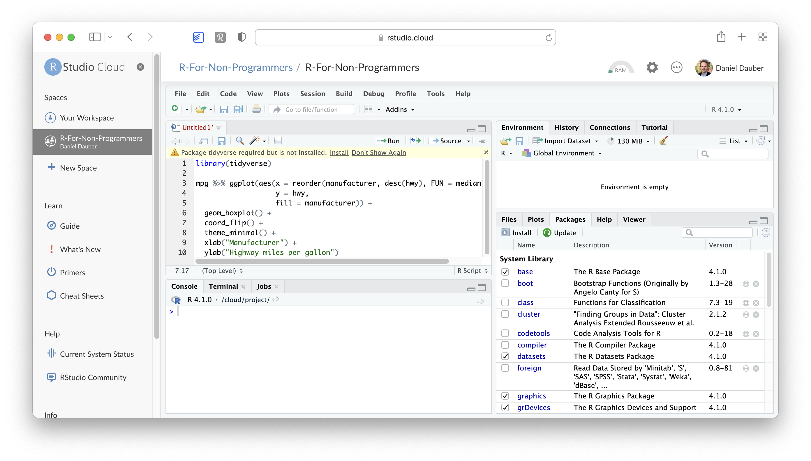

7.  Now we can execute the code as we would on the desktop version (see Chapter \@ref(r-basics-the-very-fundamentals)).

    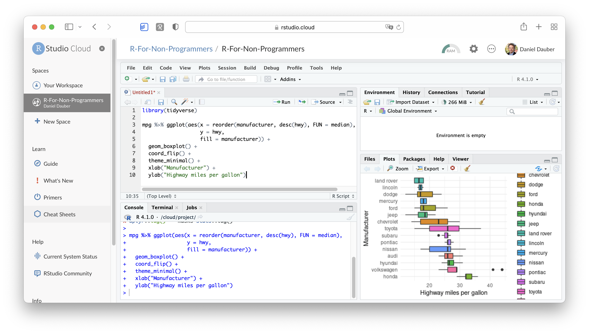

[^setting_up_r_rstudio-1]: RStudio and RStudio Cloud warn you if you need to install certain R packages to successfully run code. More about R packages and what they are can be found in Chapter \@ref(r-packages).

No matter whether you choose to use a desktop version of RStudio or RStudio Cloud, you will be able to follow along in this book with no problem.
