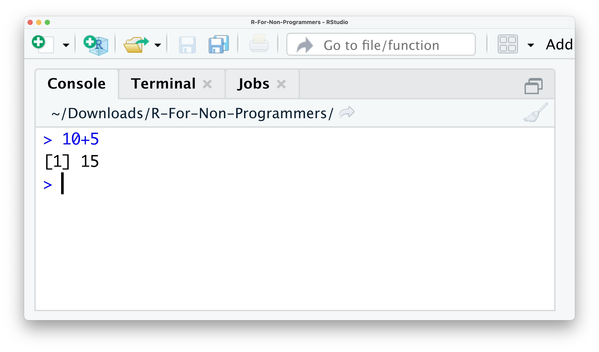
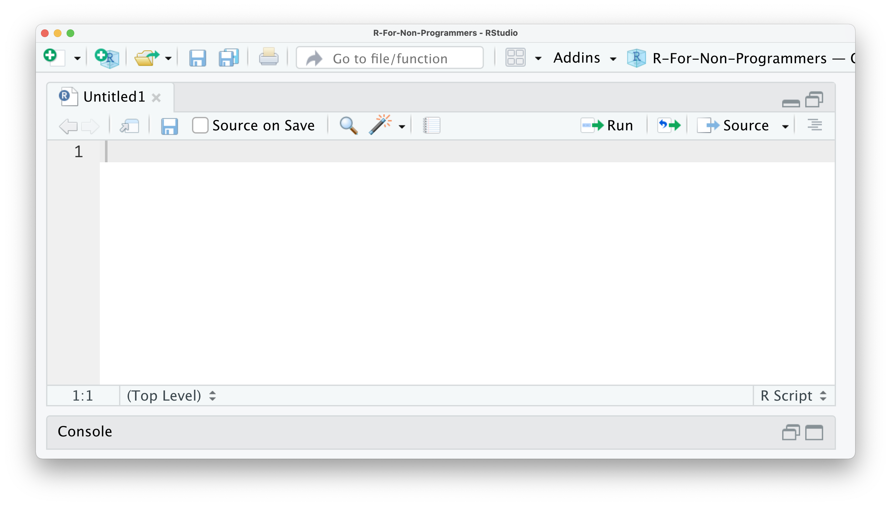
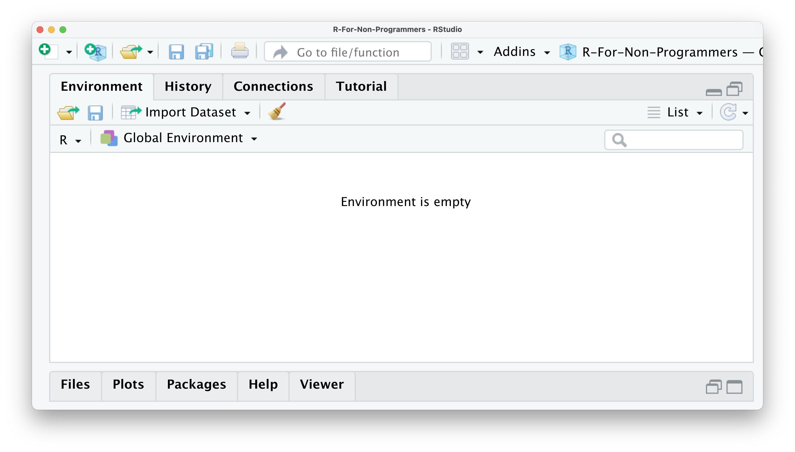
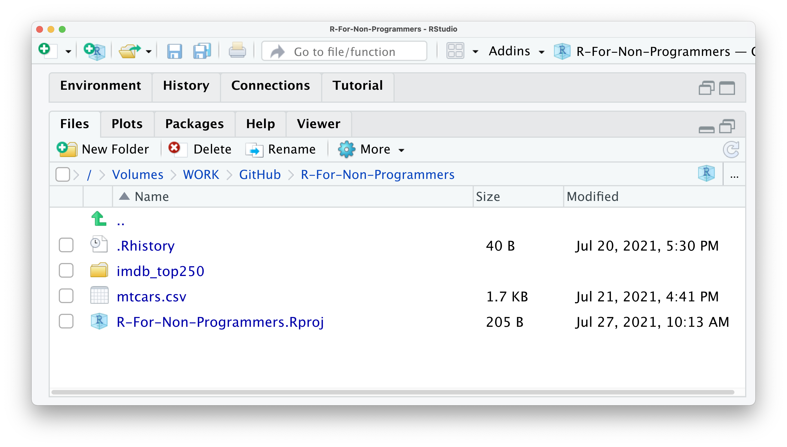
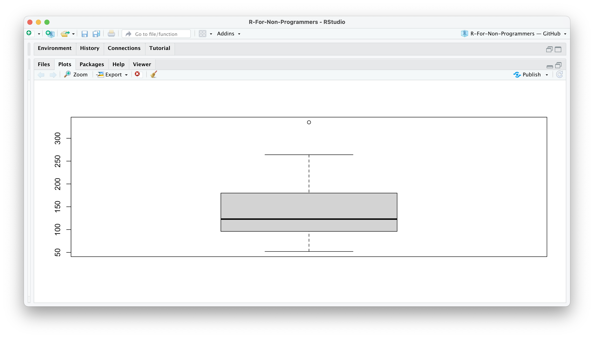
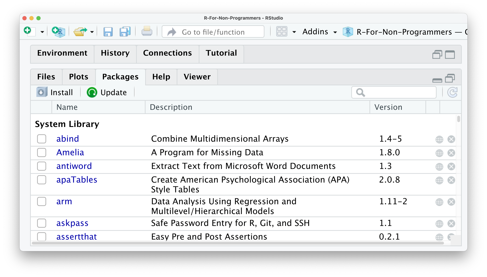
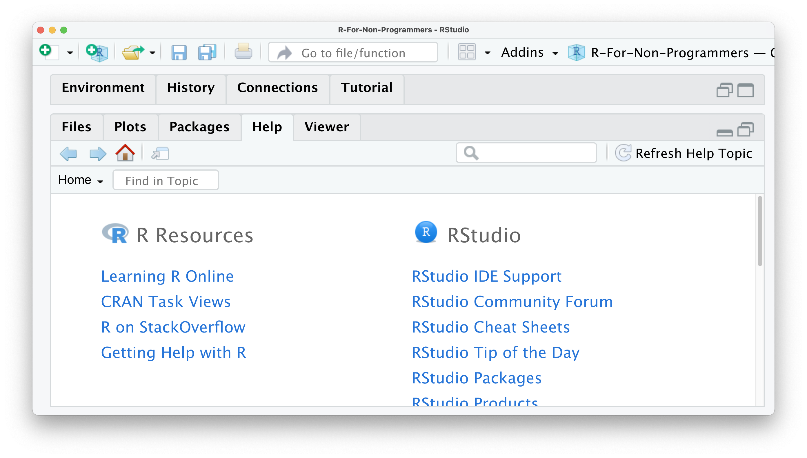
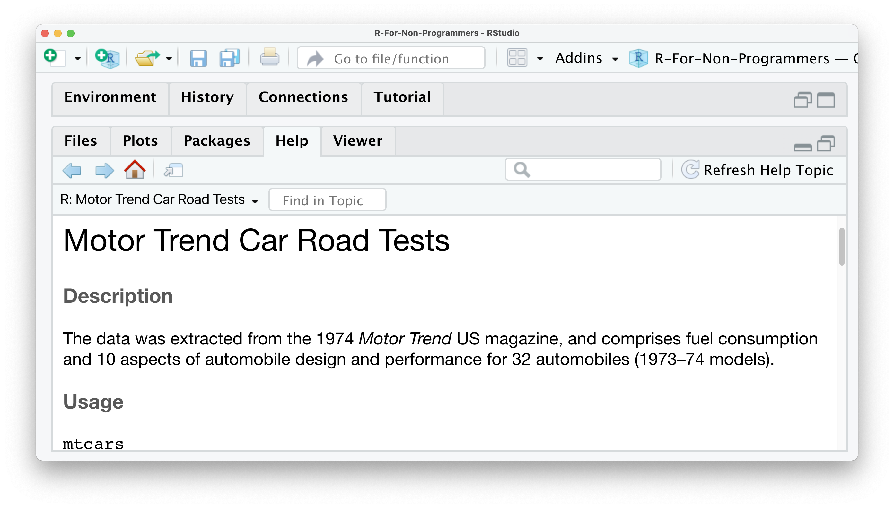

# The RStudio Interface {#the-rstudio-interface}

When you open RStudio for the first time, you are presented with four quadrants, each of which fulfils a unique purpose:

-   The `Console` window,

-   The `Source` window,

-   The `Environment / History / Connections / Tutorial` window, and

-   The `Files / Plots / Packages / Help / Viewer` window

I will briefly explain the purpose of each window/pane and how they are relevant to your work in *R*.

## The Console window

The console is located in the bottom-left, and it is where you often will find the output of your coding and computations. It is also possible to write code directly into the console. Let's try the following example by calculating the sum of `10 + 5`. Click into the console with your mouse, type the calculation into your console and hit `Enter/Return ↵` on your keyboard. The result should be pretty obvious:

```{r Algebra in the Console, echo=TRUE, collapse=TRUE}
# We type the below into the console 👇
10+5
```

Here is a screenshot of how it should look like at your end in RStudio:



You just successfully performed your first successful computation. I know, this is not quite impressive just yet. *R* is undoubtedly more than just a giant calculator.

In the top right of the console, you find a symbol that looks like a broom. This one is quite an important one because it clears your console. Sometimes the console can become very cluttered and difficult to read. If you want to remove whatever you computed, you can click the broom icon and clear the console of all text. I use it so frequently that I strongly recommend learning the keyboard shortcut, which is `Ctrl+L` on PC and Mac.

## The Source window {#the-source-window}

In the top left, you can find the source window. The term 'source' can be understood as any type of file, e.g. data, programming code, notes, etc. The source panel can fulfil many functions, such as:

-   Inspect data in an Excel-like format (LINK TO RELEVANT CHAPTER)

-   Open programming code, e.g. an R Script (LINK TO RELEVANT CHAPTER)

-   Open other text-based file formats, e.g.

    -   Plain text (.txt),

    -   Markdown (.md),

    -   Websites (.html),

    -   LaTeX (.tex),

    -   BibTex (.bib),

-   Edit scripts with code in it,

-   Run the analysis you have written.



In other words, the source window will show you whatever file you are interested in, as long as RStudio can read it - and no, Microsoft Office Documents are not supported. Another limitation of the source window is that it can only show text-based files. So opening images, etc. would not work.

## The Environment / History / Connections / Tutorial window {#the-environment-history-connections-tutorial-window}

The window in the top right shows multiples panes. The first pane is called *Environment* and shows you objects which are available for computation. One of the first objects you will create is your dataset because, without data, we cannot perform any analysis. Thus, one object might be your data. Another object could be a plot showing the number of male and female participants in your study. To find out how to create objects yourself, you can take a glimpse at (INSERT CHAPTER X). Besides datasets and plots, you will also find other objects here, e.g. lists, vectors and functions you created yourself. Don't worry if none of these words makes sense at this point. We will cover each of them in the upcoming chapters. For now, remember this is a place where you can find different objects you created.



The *History* pane is very easy to understand. Whatever computation you run in the Console will be stored. So you can go back and see what you coded and rerun that code. Remember the example from above where we computed the sum of `10+5`? This computation is stored in the history of RStudio, and you can rerun it by clicking on `10+5` in the history pane and then click on `To Console`. This will insert `10+5` back into the Console, and we can hit `Return ↵` to retrieve the result. You also have the option to copy the code into an existing or new R Script by clicking on `To Source`. By doing this, you can save this computation on your computer and reuse it later. Finally, if you would like to store your history, you can do so by clicking on the `floppy disk symbol`. There are two more buttons in this pane, one allows you to delete individual entries in the history, and the last one, a `broom`, clears the entire history (irrevocably).


The pane *Connections* allows you to tab into external databases directly. This can come in handy when you work collaboratively on the same data or want to work with extensive datasets without having to download them. However, for an introduction to R, we will not use this feature of RStudio for now.


The last pane is called *Tutorial*. Here you can find additional materials to learn *R* and RStudio. If you search for more great content to learn R, this serves as a great starting point.


## The Files / Plots / Packages / Help / Viewer window {#the-files-plots-packages-help-viewer-window}

The last window consists of five essential panes. The first one is the *Files* pane. As the name indicates, it lists all the files and folders in your root directory. A root directory is the default directory where RStudio saves your files, for example, your analysis. However, you can easily change this directory to something else (see also CHAPTER X) or use R Project files (see CHAPTER X) to carry out your research. Thus, the *Files* pane is an easy way to load data into RStudio and create folders to keep your research project well organised.



Since the Console cannot reproduce data visualisations, RStudio offers a way to do this very easily. It is through the Plots pane. This pane is exclusively designed to show you any plots you have created using R. Here is a simple example that you can try. Type into your console `boxplot(mtcars$hp)`.

```{r Simple boxplot, echo=TRUE, collapse=TRUE}
# Here we create a nice boxplot using a dataset called 'mtcars'
boxplot(mtcars$hp)
```

Although this is a short piece of coding, it performs quite a lot of steps:

-   it uses a function called `boxplot()` to draw a boxplot of

-   a variable called `hp` (for horsepower), which is located in

-   a dataset named `mtcars`,

-   and it renders the graph in your *Plots* pane

This is how the plot should look like in your RStudio *Plots* pane.



If you wish to delete the plot, you can click on the `red circle with a white x` symbol. This will delete the currently visible plot. If you wish to remove all plots from this pane, you can use the `broom`. There is also an option to export your plot and move back and forth between different plots.

Do not worry about the coding at this point. It will all make sense in the following chapters.

The next pane is called *Packages*. Packages are additional tools you can import and use when performing your analysis. A frequent analogy people use to explain packages is your phone and the apps you install. Each package you download is equivalent to an app on your phone. It can enhance different aspects of working in *R*, such as creating animated plots, using unique machine learning algorithms, or simply making your life easier by doing multiple computations with just one single line of code. You will learn more about *R packages* in Chapter \@ref(r-packages).



If you are in dire need of help, RStudio provides you with a *Help* pane. You can search for specific topics, for example how certain computations work. The *Help* pane also has documentation on different datasets that are included in *R*, RStudio or *R packages* you have installed. If you want a more comprehensive overview of how you can find help, have a look at CRAN's ['Getting Help with R'](https://www.r-project.org/help.html "'Getting Help with R'"){target="blank"} webpage.



So, for example, if you want to know what the `mtcars` dataset is, you can either use the search window in the *Help* pane or, much easier, use a `?` in the console to search for it:

```{r Using '?' to get help, echo=TRUE}

# Type a '?' and immediately add the name to bring up helpful information.

?mtcars
```

This will open the *Help* pane and give you more information about this dataset:



There are many different ways of how you can find help with your coding beyond RStudio and this book. My top three platforms to find solutions to my programming problems are:

-   [Google](https://www.google.com "Google")

-   [stackoverflow.com](https://stackoverflow.com "stackoverflow.com"){target="blank"}

-   [Twitter](https://twitter.com/home "Twitter"){target="blank"} (with [\#RStats](https://twitter.com/hashtag/rstats "#RStats"){target="blank"})

Lastly, we have the *Viewer* pane. Not every data visualisation we create in R is a static image. You can create dynamic data visualisations or even websites with R. This type of content is displayed in the Viewer pane rather than in the Plots pane. Often these visualisations are based on HTML and other web-based programming languages. As such, it is easy to open them in your browser as well. However, in this book, we mainly focus on two-dimensional static plots, which are the ones you likely need most of the time, either for your assignments, thesis, or publication.


## Customise your user interface {#customise-your-user-interface}

As a last remark in this chapter, I would like to make you aware that you can modify each window. There are three basic adjustments you can make:

-   Hide panes by clicking on the window symbol in the top right corner of each window,

-   Resize panes by dragging the border of a window horizontally or vertically, or

-   Add and remove panes by going to `RStudio > Preferences > Pane Layout`, or use the keyboard shortcut `⌘ + ,` if you are on a Mac. There is, unfortunately no default shortcut for PC users.
