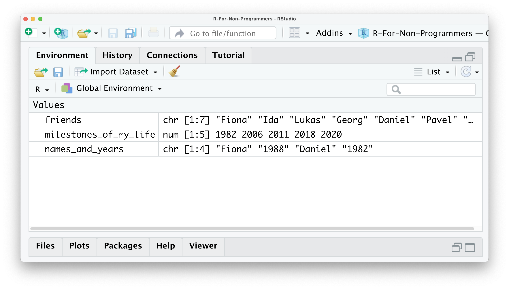
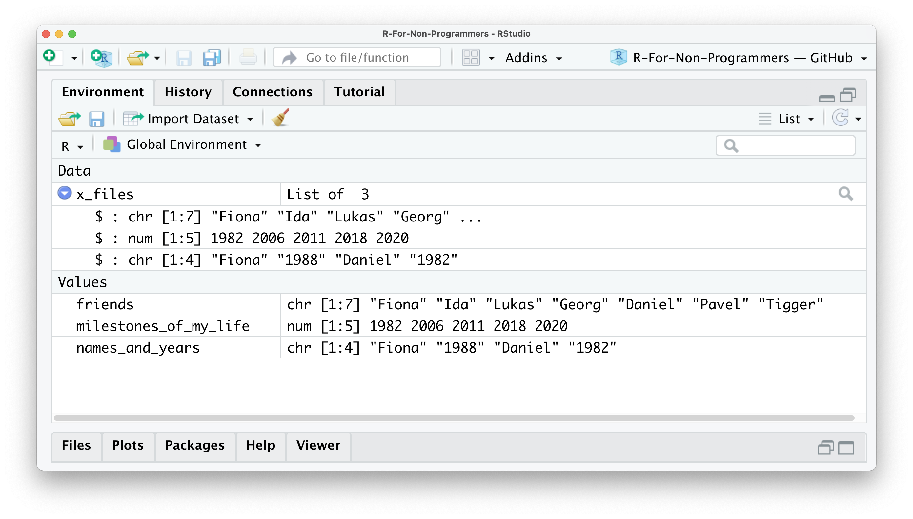
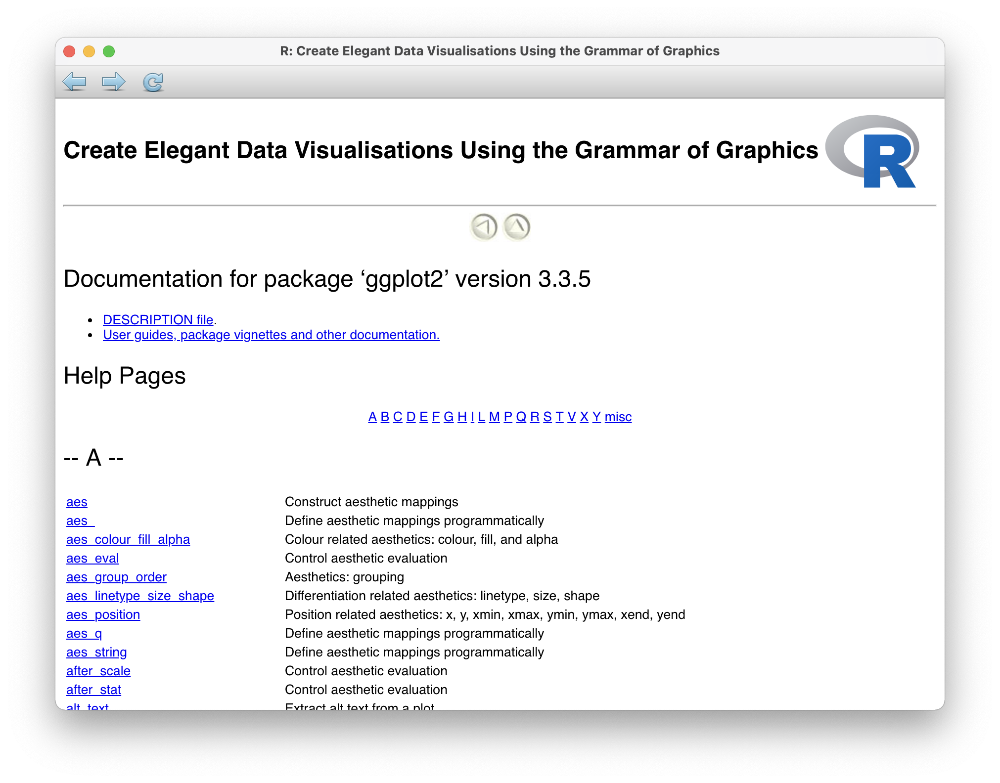
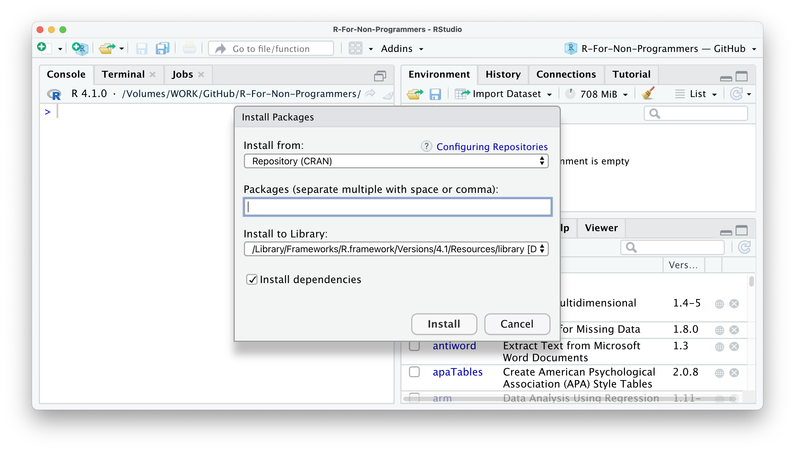

# R Basics: The very fundamentals {#r-basics-the-very-fundamentals}

After a likely tedious installation of R and RStudio, as well as a somewhat detailed introduction to the RStudio interface, you are finally ready to 'do' things. By 'doing', I mean coding. The term 'coding' in itself can instil fear in some of you, but you only need one skill to do it: Writing. As mentioned earlier, learning coding or programming means learning a new language. However, once you have the basic grammar down, you already can communicate quite a bit. In this section, we will explore the fundamentals of R. These build the foundation for everything that follows. After that, we dive right into some analysis.

## Basic computations in R {#basic-computations-in-r}

The most basic computation you can do in R is arithmetic operations. In other words, addition, subtraction, multiplication, division, exponentiation and extraction of roots. In other words, R can be used like your pocket calculator, or more likely the one you have on your phone. For example, in Chapter \@ref(the-console-window) we already performed an addition. Thus, it might not come as a surprise how their equivalents work in R. Let's take a look at the following examples:

```{r Arithmetic examples, echo=TRUE}
# Addition
10 + 5

# Subtraction
10 - 5

# Multiplication
10 * 5

# Division
10 / 5

# Exponentiation
10 ^ 2

# Square root
sqrt(10)
```

They all look fairly straightforward except for the extraction of roots. As you probably know, extracting the root would typically mean we use the symbol $\sqrt{}$ on your calculator. To compute the square root in R, we have to use a function instead to perform the computation. So we first put the name of the function `sqrt` and then the value `10` within parenthesis `()`. This results in the following code: `sqrt(10)`. If we were to write this down in our report, we would write $\sqrt[2]{10}$.

Functions are an essential part of R and programming in general. You will learn more about them in this chapter.Besides arithmetic operations, there are also logical queries you can perform. Logical queries always return either the value TRUE or FALSE. Here are some examples which make this clearer:

```{r Logical queries, echo=TRUE}

#1 Is it TRUE or FALSE?
1 == 1

#2 Is 45 bigger than 55?
45 > 55

#3 Is 1982 bigger or equal to 1982?
1982 >= 1982

#4 Are these two words NOT the same?
"Friends" != "friends"

#5 Are these sentences the same?
"I love statistics" == "I love statistícs"

```

Reflecting on these examples, you might notice three important things:

1.  I used `==` instead of `=`,
2.  I can compare non-numerical values, i.e. text, which is also known as `character` values, with each other,
3.  The devil is in the details (considering \#5).

One of the most common mistakes of R novices is the confusion around the `==` and `=` notation. While `==` represents `equal to`, `=` is used to assign a value to an object (for more details on assignments see Chapter \@ref(the-files-plots-packages-help-viewer-window)). However, in practice, most R programmers tend to avoid `=` since it can easily lead to confusion with `==`. As such, you can strike this one out of your R vocabulary for now.

There are many different logical operations you can perform. Table \@ref(tab:logical-operators-r) lists the most frequently used logical operators for your reference. These will become important once we select only certain parts of our data for analysis, e.g. only `female` participants.

| Operator | Description            |
|----------|------------------------|
| ==       | is equal to            |
| \>=      | is bigger or equal to  |
| \<=      | is smaller of equal to |
| !=       | is not equal to        |
| a \| b   | a or b                 |
| a & b    | a and b                |
| !a       | is not a               |

: (\#tab:logical-operators-r) Logical Operators in R

## Assigning values to objects: '\<-' {#assigning-values-to-objects}

Another common task you will perform is assigning values to an object. An object can be many different things:

-   a dataset,

-   the results of a computation,

-   a plot,

-   a series of numbers,

-   a list of names,

-   a function,

-   etc.

In short, an object is an umbrella term for many different things which form part of your data analysis. For example, objects are handy when storing results that you want to process further in later analytical steps. Let's have a look at an example.

```{r Saving values in objects, echo=TRUE}

# I have a friend called "Fiona"
friends <- "Fiona"
```

In this example, I created an object called `friends` and added `"Fiona"` to it. Remember, because `"Fiona"` represents a `string`, we need `""`. So, if you wanted to read this line of code, you would say, '`friends` gets the value `"Fiona"`'. Alternatively, you could also say '`"Fiona"` is assigned to `friends`'.

If you look into your environment pane, you will find the object we just created. You can see it carries the value `"Fiona"`. We can also print values of an object in the console by simply typing the name of the object `friends` and hit `Return ↵`.

```{r Printing objects, echo=TRUE}

# Who are my friends?
friends
```

Sadly, it seems I only have one friend. Luckily we can add some more, not the least to make me feel less lonely. To create objects with multiple values, we can use the function `c()`, which stands for 'concatenate'. The @concatenate-2021 define this word as follows:

> '***concatenate***',
>
> to put things together as a connected series

Let's concatenate some more friends into our `friends` object.

```{r Concatenate function, echo=TRUE}
# Adding some more friends to my life
friends <- c("Fiona",
             "Ida",
             "Lukas",
             "Georg",
             "Daniel",
             "Pavel",
             "Tigger")

# Here are all my friends
friends
```

To concatenate values into a single object, we need to use a comma `,` to separate each value. Otherwise, R will report an error back.

```{r Concatenate function error, echo=TRUE, error=TRUE, purl=FALSE}
friends <- c("Fiona" "Ida")
```

R's error messages tend to be very useful and give meaningful clues to what went wrong. In this case, we can see that something 'unexpected' happen, and it shows where our mistake is.

You can also concatenate numbers, and if you add `()` around it, you can automatically print the content of the object to the console. Thus, `(milestones_of_my_life <- c(1982, 2006, 2011, 2018, 2020))` is the same as `milestones_of_my_life <- c(1982, 2006, 2011, 2018, 2020)` followed by `milestones_of_my_life`. The following examples illustrate this.

```{r Concatenating numbers, echo=TRUE}
# Important years in my life
milestones_of_my_life <- c(1982, 2006, 2011, 2018, 2020)
milestones_of_my_life

# The same as above - no second line of code needed
(milestones_of_my_life <- c(1982, 2006, 2011, 2018, 2020))
```

Finally, we can also concatenate numbers and character values into one object:

```{r Concatenating numbers and strings, echo=TRUE}
(names_and_years <- c("Fiona", 1988, "Daniel", 1982))
```

This last example is not necessarily something I would recommend to do, because it likely leads to undesirable outcomes. If you look into your environment pane you currently have three objects: `friends`, `milestones_of_my_life`, and `names_and_years`.



The `friends` object shows that all the values inside the object are classified as `chr`, which denominates `character`. In this case, this is correct because it only includes the names of my friends. On the other hand, the object `milestones_of_my_life` only includes `numeric` values, and therefore it says `num` in the environment pane. However, for the object `names_and_years` we know we want to have `numeric` and `character` values included. Still, R recognises them as `character` values only because values inside objects are meant to be of the same type.

Consequently, mixing different types of data (as explained in Chapter \@ref()) into one object is likely a bad idea. This is especially true if you want to use the numeric values for computation. In short: ensure your objects are all of the same data type.

There is an exception to this rule. 'Of course', you might say. There is one object that can have values of different types: `list`. As the name indicates, a `list` object holds several items. These items are usually other objects. In the spirit of '[Inception](https://www.imdb.com/title/tt1375666/?ref_=ext_shr_lnk)', you can have lists inside lists, which contain more objects.

Let's create a list called `x_files` using the `list` function and place all our objects inside.

```{r Creating a list, echo=TRUE}
# This creates our list of objects
x_files <- list(friends,
               milestones_of_my_life,
               names_and_years)

# Let's have a look what is hidden inside the x_files
x_files
```

You will notice in this example that I do not use `""` for each value in the list. This is because `friends` is not a character I put into the list, but an object. When we refer to objects, we do not need quotation marks.

We will encounter `list` objects quite frequently when we perform our analysis. Some functions return the results in the format of lists. This can be very helpful because otherwise our environment pane will be littered with objects. We would not necessarily know how they relate to each other, or worse, to which analysis they belong. Looking at the list item in the environment page (Figure \@ref(fig:img-x-files)), you can see that the object `x_files` is classified as a `List of 3,` and if you click on the blue icon, you can inspect the different objects inside.

```{r, fig.cap = "The environment pane showing our objects and our list `x_files`", label = "img-x-files", echo=FALSE}

```

In Chapter \@ref(basic-computations-in-r), I mentioned that we should avoid using the `=` operator and explained that it is used to assign values to objects. You can, if you want, use `=` instead of `<-`. They fulfil the same purpose. However, as mentioned before, it is not wise to do so. Here is an example that shows that, in principle, it is possible.

```{r Using the two assign operators, echo=TRUE}
# DO
(avengers1 <- c("Iron Man",
                "Captain America",
                "Black Widow",
                "Vision"))

# DON'T
(avengers2 = c("Iron Man",
               "Captain America",
               "Black Widow",
               "Vision"))
```

On a final note, naming your objects is limited. You cannot chose any name. First, every name needs to start with a letter. Second, you can only use letters, numbers `_` and `.` as valid components of the names for your objects [see also @wickham2016r, Chapter 4.2.]. I recommend to establish a naming convention that you adhere to. Personally I prefer to only user lower letters and `_` to separate/connect words. You want to keep names informative, succinct and precise. Here are some examples of what some might consider good and bad choices for names.

```{r Naming your objects, echo=TRUE, eval=FALSE}
# Good choices
income_per_annum
open_to_exp          # for 'openness to new experiences'
soc_int              # for 'social integration'
 
# Bad choices
IncomePerAnnum
measurement_of_boredom_of_watching_youtube
Sleep.per_monthsIn.hours
```

Ultimately, you need to be able to effectively work with your data and output. Ideally, this should be true for others as well who want or need to work with your R project as well, e.g. your co-investigator or supervisor. The same is true for your column names in datasets (see Chapter \@ref()). Some more information about coding style (i.e. the style of writing coding) can be found in Chapter \@ref(coding-etiquette).

## Functions {#functions}

I used the term 'function' multiple times, but I never thoroughly explained what they are and why we need them. In simple terms, functions are objects. They contain lines of code that someone has written for us or we have written ourselves. One could say they are code snippets ready to use. Someone else might see them as shortcuts for our programming. Functions increase the speed with which we perform our analysis and write our computations and make our code more readable. Consider computing the `mean` of values stored in the object `pocket_money`.

```{r Mean function example, echo=TRUE, label="mean-function-example"}
# First we create an object that stores our desired values
pocket_money <- c(0, 1, 1, 2, 3, 5, 8, 13, 21, 34, 55, 89)

#1 Manually compute the mean
sum <- 0 + 1 + 1 + 2 + 3 + 5 + 8 + 13 + 21 + 34 + 55 + 89
sum / 12 # There are 12 items in the object

#2 Use a function to compute the mean
mean(pocket_money)

#3 Let's make sure #1 and #2 are actually the same
sum / 12 == mean(pocket_money)
```

If we manually compute the mean, we first calculate the sum of all values in the object `pocket_money`[^r_basics-1]. Then we divide it by the number of values in the object, which is `12`. This is the traditional way of computing the mean as we know it from primary school. However, by simply using the function `mean()`, we not only write considerably less code, but it is also much easier to understand as well because the word `mean` does precisely what we would expect. Which one do you find easier?

[^r_basics-1]: If you find the order of numbers suspicious, it is because it represents the famous [Fibonacci sequence](https://en.wikipedia.org/wiki/Fibonacci_number "Fibonacci sequence"){target="blank"}.

To further illustrate how functions look like, let's create one ourselves and call it `my_mean`.

```{r Creating our own mean function, echo=TRUE}
my_mean <- function(numbers){
  # Compute the sum of all values in 'numbers'
  sum <- sum(numbers)
  
  # Divide the sum by the number of items in 'numbers'
  result <- sum/length(numbers)
  
  # Return the result in the console
  return(result)
}

my_mean(pocket_money)
```

Do not worry if half of this code does not make sense to you. Writing functions is an advanced R skill. However, it is good to know how functions look on the 'inside'. You certainly can see the similarities between the code we have written before, but instead of using actual numbers, we work with placeholders like `numbers`. This way, we can use a function for different data and do not have to rewrite it every time.

All functions in R share the same structure. They have a `name` followed by `()`. Within these parentheses, we put `arguments`, which have specific `values`. For example, a function would look something like this:

```{r Generic function, eval=FALSE, error=TRUE, purl=FALSE, results='hide'}
name_of_function(argument_1 = value_1,
                 argument_2 = value_2,
                 argument_3 = value_3)
```

How many arguments there are and what kind of values you can provide is very much dependent on the function you use. Thus, not every function takes every value. In the case of `mean()`, the function takes an object which holds a sequence of `numeric` values. It would make very little sense to compute the mean of our `friends` object, because it only contains names. R would return an error message:

```{r Mean of an object with characters, echo=TRUE, error=TRUE, purl=FALSE}
mean(friends)
```

`NA` refers to a value that is *'not available'*. In this case, R tries to compute the mean, but the result is not available, because the values are not `numeric` but a `character`. In your dataset, you might find cells that are `NA`, which means there is data missing. Remember: If a function attempts a computation that includes even just a single value that is `NA`, R will return `NA`. However, there is a way to fix this. You will learn more about how to deal with `NA` values in Chapter \@ref().

Sometimes you will also get a message from R that states `NaN`. `NaN` stands for *'not a number'* and is returned when something is not possible to compute, for example:

```{r NaN example: Division by zero, echo=TRUE, error=TRUE, purl=FALSE}
# Example 1
0 / 0

# Example 2
sqrt(-9)
```

## R packages {#r-packages}

R has many built-in functions that we can use right away. However, some of the most interesting ones are developed by different programmers, data scientists and enthusiasts. To add more functions to your repertoire, you can install R packages. R packages are a collection of functions that you can download and use for your own analysis. Throughout this book, you will learn about and use many different R packages to accomplish various tasks.

To give you another analogy,

-   R is like a global supermarket,

-   RStudio is like my shopping cart,

-   and R packages are the products I can pick from the shelves.

Luckily, R packages are free to use, so I do not have to bring my credit card. For me, these additional functions, developed by some of the most outstanding scientists, is what keeps me addicted to performing my research in R.

R packages do not only include functions but often include datasets and documentation of what each function does. This way, you can easily try every function right away, even without your own dataset and read through what each function in the package does. Figure \@ref(fig:img-r-package-documentation)

```{r, fig.cap = "The R package documentation for 'ggplot2'", label = "img-r-package-documentation", echo=FALSE}

```

However, how do you find those R packages? They are right at your fingertips. You have two options:

1.  Use the function `install.packages()`

2.  Use the packages pane in RStudio (see Chapter \@ref(the-files-plots-packages-help-viewer-window))

### Installing packages using `install.packages()` {#installing-packages-using-a-function}

The simplest and fastest way to install a package is calling the function `install.packages()`. You can either use it to install a single package or install a series of packages all at once using our trusty `c()` function. All you need to know is the name of the package. This approach works for all packages that are on CRAN (remember CRAN from Chapter \@ref(installing-r)?). <a id="install-packages-tidyverse-nanair-psych"></a>

```{r Installing R packages via functions, eval=FALSE, echo=TRUE, results='hide'}
# Install a single package
install.packages("tidyverse")

# Install multiple packages at once
install.packages(c("tidyverse", "naniar", "psych"))
```

If a package is not available from CRAN, chances are you can find them on [GitHub](https://github.com){target="blank"}. GitHub is probably the world's largest global platform for programmers from all walks of life, and many of them develop fantastic R packages that make R programming not just easier but a lot more fun. As you continue to work in R, you should seriously consider creating your own account to keep backups of your R projects (see also Chapter \@ref(next-steps-github)).

An essential companion for this book is `r4np`, which contains all datasets for this book and some useful functions to get you up and running in no time. <a id="install-r4np"></a>

```{r Installing R packages via functions from GitHub, eval=FALSE, echo=TRUE, results='hide'}
# Install the 'r4np' pacakge from GitHub
devtools::install_github("ddauber/r4np")
```

### Installing packages via RStudio's package pane {#installing-packages-via-rstudio}

RStudio offers a very convenient way of installing packages. In the packages pane, you cannot only see your installed packages, but you have two more buttons: `Install` and `Update`. The names are very self-explanatory. To install an R package you can follow the following steps:

1.  Click on `Install`.

2.  In most cases, you want to make sure you have `Repository (CRAN)` selected.

    

3.  Type in the name of the package you wish to install. RStudio offers an auto-complete feature to make it even easier to find the package you want.

    

4.  I recommend NOT to change the option which says `Install to library.` The default library settings will suffice.

5.  Finally, I recommend to select `Install dependencies`, because some packages need other packages to function properly. This way, you do not have to do this manually.

    

The only real downside of using the packages pane is that you cannot install packages hosted on GitHub only. However, you can download them from there and install them directly from your computer using this option. This is particularly useful if you do not have an internet connection but you already downloaded the required packages onto a hard drive.

### Using R Packages {#using-r-packages}

Now that you have a nice collection of R packages, the next step would be to use them. While you only have to install R packages once, you have to 'activate' them every time you start an new session in RStudio. This process is also called 'loading an R package'. Once an R package is loaded, you can use all its functions. To load an R package, we have to use the function `library()`.

```{r Loading an R package, echo=TRUE, warning=FALSE}
library(tidyverse)
```

The `tidyverse` package is a special kind of package. It contains multiple packages and loads them all at once. Almost all included packages (and more) you will use at some point when working through this book.

I know what you are thinking. Can you use `c()` to load all your packages at once? Unfortunately not. However, there is a way to do this, but it goes beyond the scope of this book to fully explain this (if you are curious, you can take a peek [here](https://stackoverflow.com/questions/8175912/load-multiple-packages-at-once "Loading multiple R packages at once"){target="blank"}).

Besides, it is not always advisable to load all functions of an entire package. One reason could be that two packages contain a function with the same name but with a different purpose. Two functions with the same name create a conflict between these two packages, and one of the functions would not be usable. Another reason could be that you only need to use the function once, and loading the whole package to use only one specific function seems excessive. Instead, you can explicitly call functions from packages without loading the package. For example, we might want to use the `vismis()` function from the `naniar` package to show where data is missing in our dataset `airquality`. Writing the code this way is also much quicker than loading the package and then calling the function if you don't use it repeatedly. Copy the code and try it yourself. Make sure you have `naniar` installed (see [above](#install-packages-tidyverse-nanair-psych)). We will work with this package when we explore missing data in Chapter \@ref().

```{r Explicitly calling functions from R packages, echo=TRUE}
# Here I use the dataset 'airquality', which comes with R
naniar::vis_miss(airquality)
```

## Coding etiquette {#coding-etiquette}

Now you know everything to get started, but before we jump into our first project, I would like to briefly touch upon coding etiquette. This is not something that improves your analytical or coding skills directly, but is essential in building good habbits and making your life and those of others a little easier. Consider writing code like growing plants in your garden. You want to nurture the good plants, remove the weed and add labels that tell you which plant it is that you are growing. At the end of the day, you want your garden to be well-maintained. Treat you programming code the same way.

A script (see Chapter \@ref()) with code should always have at least the following qualities:

-   Only contains code that is necessary,

-   Is easy to read and understand,

-   Is self-contained.

With simple code this is easily achieved. However, what about more complex and longer code representing a whole set of analytical steps?

```{r Messy code, echo=TRUE, eval=FALSE}
# Very messy code

library(tidyverse)
library(jtools)
model1 <- lm(covid_cases_per_1m ~ idv, data = df)
summ(model1, scale = TRUE, transform.response = TRUE, vifs = TRUE)
df %>% ggplot(aes(x = covid_cases_per_1m, y = idv, col = europe, label = country))+
theme_minimal()+ geom_label(nudge_y = 2) + geom_point()
mod_model2 <- lm(cases_per_1m ~ idv + uai + idv*europe + uai*europe, data = df)
summ(mod_model2, scale = TRUE, transform.response = TRUE, vifs = TRUE)
anova(mod_model1, mod_model2)
```

How about the following in comparison?

```{r Well-structured code, echo=TRUE, eval=FALSE}
# Nicely structured code

# Load required R packages
library(tidyverse)
library(jtools)

# ---- Modelling COVID-19 cases ----

## Specify and run a regression
model1 <- lm(covid_cases_per_1m ~ idv, data = df)

## Retrieve the summary statistics of model1
summ(model1,
     scale = TRUE,
     transform.response = TRUE,
     vifs = TRUE)

# Does is matter whether a country lies in Europe?

## Visualise rel. of covid cases, idv and being a European country
df %>%
  ggplot(aes(x = covid_cases_per_1m,
             y = idv,
             col = europe,
             label = country)) +
  theme_minimal() +
  geom_label(nudge_y = 2) +
  geom_point()

## Specify and run a revised regression
mod_model2 <- lm(cases_per_1m ~ idv + uai + idv*europe + uai*europe,
                 data = df)

## Retrieve the summary statistics of model2
summ(mod_model2,
     scale = TRUE,
     transform.response = TRUE,
     vifs = TRUE)

## Test whether model2 is an improvement over model1
anova(mod_model1, mod_model2)
```

I hope we can agree that the second example is much easier to read and understand even though you probably do not understand most of it yet. For once, I separated the different analytical steps from each other like paragraphs in a report. Apart from that, I added comments with `#` to provide more context to my code for someone else who wants to understand my analysis. Admittedly, this example is a little excessive. Usually, you might have fewer comments. Commenting is an integral part of programming because it allows you to remember what you did. Ideally, you want to strike a good balance between commenting on and writing your code. How many comments you need will likely change throughout your R programming journey. Think of comments as headers for your programming script that give it structure..

We can use `#` not only to write comments but also to tell R not to run particular code. This is very helpful if you want to keep some code but do not want to use it yet. There is also a handy keyboard shortcut you can use to 'deactivate' multiple lines of code at once. Select whatever you want to 'comment out' in your script and press `Ctrl+Shift+C` (PC) or `Cmd+Shift+C` (Mac).

```{r Commenting out code, echo=TRUE, results='hide'}
# mean(pocket_money) # R will NOT run this code
mean(pocket_money)   # R will run this code
```

RStudio helps a lot with keeping your coding tidy and properly formatted. However, there are some additional aspects worth considering. If you want to find out more about coding style, I highly recommend to read through the [*'The tidyverse style guide'*](https://style.tidyverse.org "'The tidyverse style guide'"){target="blank"} [@wickham-2021].\

## Exercises {#exercises-chapter-5}

1.  What is the result of $\sqrt[2]{25-16}+2*8-6$?

2.  What does the console return if you execute the following code `"Five" == 5`?

3.  Create a list called `books` and include the following book titles in it:

    -   "Harry Potter and the Deathly Hallows",

    -   "The Alchemist",

    -   "The Davinci Code",

    -   "R For Dummies"

4.  Copy and paste the function below into your RStudio console and run it. What does the function do when you use it?

    ```{r Function exercise, echo=TRUE, results='hide'}

    x_x <- function(number1, number2){
      result1 <- number1 * number2
      result2 <- sqrt(number1)
      result3 <- number1 - number2
      return(c(result1, result2, result3))
    } 
    ```

5.  What are the three steps to use a new R package that you found on CRAN?

Check you answers: Solutions \@ref(exercises-solutions-5)
