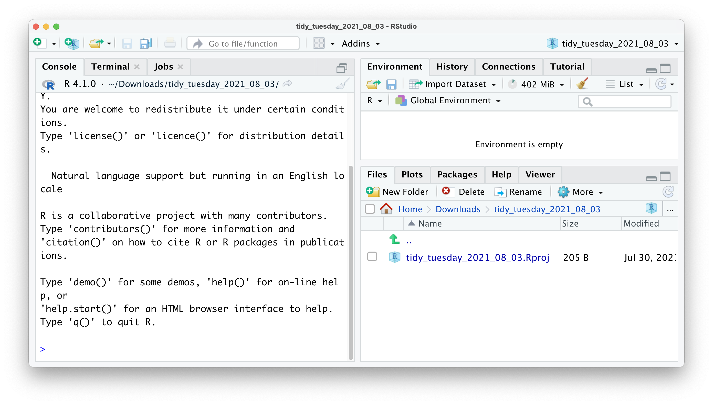
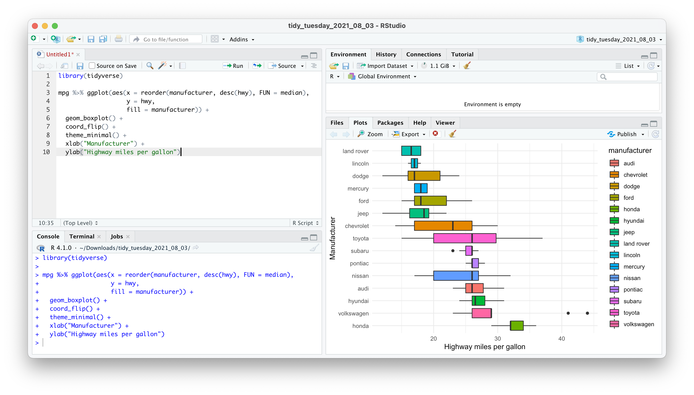
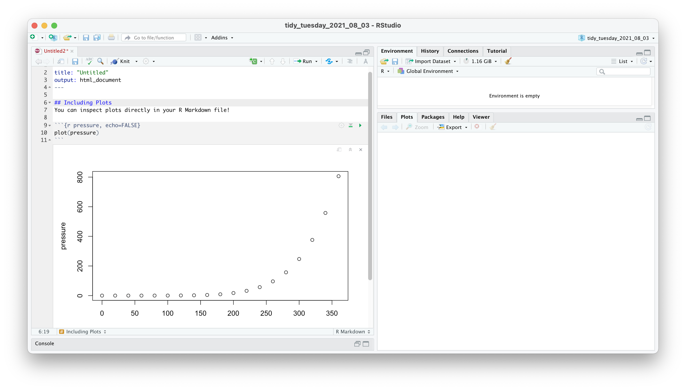
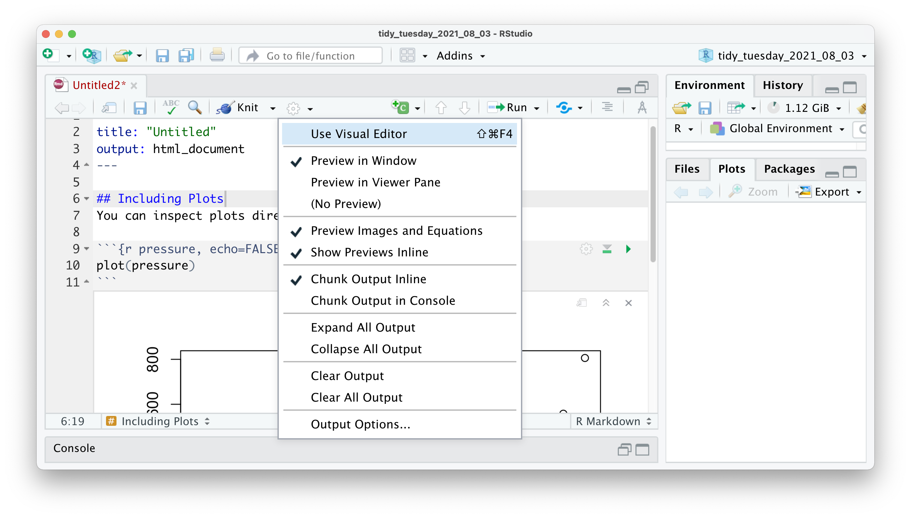
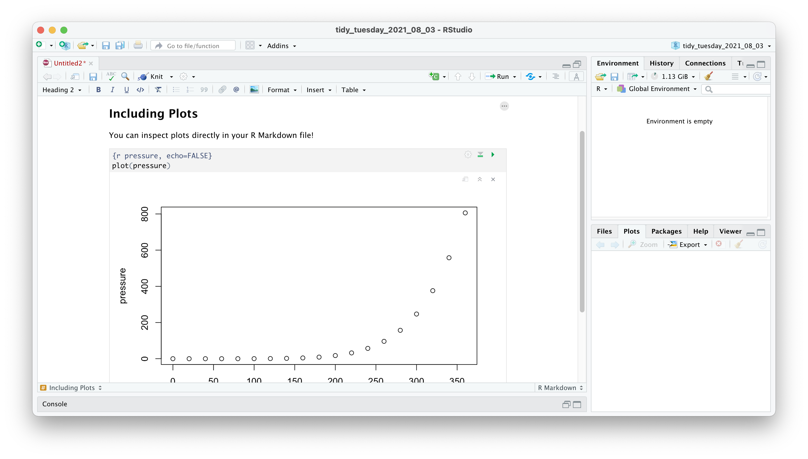

# Starting your R projects {#starting-your-r-projects}

Every project likely fills you with enthusiasm and excitement. And it should. You are about to find answers to your questions, and you hopefully come out more knowledgeable due to it. However, there are likely certain aspects of data analysis that you find less enjoyable. I can think of two:

-   Keeping track of all the files my project generates

-   Data wrangling

While we cover data wrangling in great detail later (Chapter \@ref(data-wrangling)), I would like to share some insights from my work that helped me stay organised and, consequently, less frustrated. The following applies to small and large research projects, which makes it very convenient no matter the situation. Of course, feel free to tweak my approach to whatever suits you. However, consistency is king.

## Creating an R Project file {#creating-an-r-project}

When working on a project, you likely create many different files for various purposes, especially R Scripts (see Chapter \@ref(creating-an-r-script)). If you are not careful, this file is stored in your system's default location, which might not be where you want them to be. RStudio allows you to manage your entire project intuitively and conveniently through R Project files. Using R Project files comes with a couple of perks, for example:

-   All the files that you generate are in the same place. Your data, your coding, your exported plots, your reports, etc., all are in one place together without you having to manage the files manually.

-   If you want to share your project, you can share the entire folder, and others can quickly reproduce your research or help fix problems. This is because all file paths are relative and not absolute.

-   You can, more easily, use GitHub for backups and so-called 'version control', which allows you to track changes you have made to your code over time (see also Chapter \@ref(next-steps-github)).

For now, the most important reason to use R Project files is the convenience of the organisation of files and the ability to share it easily with co-investigators, your supervisor, or your students.

To create an R Project, you need to perform the following steps:

1.  Select `File > New Project…` from the menu bar.

    

2.  Select `New Directory` from the popup window.

    

3.  Next, select `New Project`.

    

4.  Pick a meaningful name for your project folder, i.e. the `Directory Name`. Ensure this project folder is created in the right place. You can change the `subdirectory` by clicking on `Browse…`. Ideally the subdirectory is a place where you usually store your research projects.

    

5.  You have the option to `Create a git repository`. This is only relevant if you already have a GitHub account and wish to use version control. For now, you can happily ignore it.

6.  Lastly, tick `Open in new session`. This will open your R Project in a new RStudio window.

    

7.  Once you are happy with your choices, you can click `Create Project`. This will open a new R Session, and you can start working on your project.

    

If you look carefully, you can see that your RStudio is now 'branded' with your project name. At the top of the window, you see the project name, the files pane shows the root directory where all your files will be, and even the console shows on top the file path of your project. You could set all this up manually, but I would not recommend it, not the least because it is easy to work with R Projects.

## Organising your projects {#organising-your-projects}

This section is not directly related to RStudio, R or data analysis in general. Instead, I want to convey to you that a good folder structure can go a long way. It is an excellent habit to start thinking about folder structures before you start working on your project. Placing your files into dedicated folders, rather than keeping them loosely in one container, will speed up your work and save you from the frustration of not finding the files you need. I have a template that I use regularly. You can either create it from scratch in RStudio or open your file browser and create the folders there. RStudio does not mind which way you do it. If you want to spend less time setting this up, you might want to use the function `create_dr()` from the `r4np` package. It creates all the folders as shown in Figure \@ref(fig:folder-structure).

<a name="install_r4np"></a>

```{r Install and create a folder directory using r4np, echo=TRUE, eval=FALSE}
# Install 'r4np' from GitHub
devtools::install_github("ddauber/r4np")

# Create the template structure
r4np::create_dr()
```

To create a folder, click on `New Folder` in the Files pane. I usually have at least the following folders for every project I am involved in:

-   A folder for my raw data. I store 'untouched' datasets in it. With 'untouched', I mean they have not been processed in any way and are usually files I downloaded from my data collection tool, e.g. online questionnaire platform.

-   A folder with 'tidy' data. This is usually data I exported from R after cleaning it, i.e. after data wrangling (see Chapter \@ref(data-wrangling)).

-   A folder for my R scripts

-   A folder for my plots

-   A folder for reports

Thus, in RStudio, it would look something like this:

```{r fig.cap = "An example of a scalable folder structure for your project", label = "folder-structure", echo=FALSE}
knitr::include_graphics("images/chapter_06_img/01_organising_work/00_organising_work.png")
```

You probably noticed that my folders have numbers in front of them. I do this to ensure that all folders are in the order I want them to be, usually not the alphabetical order my computer suggests. I use two digits because I may have more than nine folders for a project, and folder ten would otherwise be listed as the third folder in this list. With this filing strategy in place, it will be easy to find whatever I need. Even others can easily understand what I stored where. It is simply 'tidy', similar to how we want our data to be.

## Creating an R Script {#creating-an-r-script}

Code quickly becomes long and complex. Thus, it is not very convenient to write it in the console. So, instead, we can write code into an R Script. An R Script is a document that RStudio recognises as R programming code. Files that are not R Scripts, like `.txt`, `.rtf` or `.md`, can also be opened in RStudio, but any code written in it will not be automatically recognised.

When opening an R script or creating a new one, it will display in the source window (see Chapter \@ref(the-source-window)). Some refer to this window as the 'script editor'. An R Script starts as an empty file. Good coding etiquette (see Chapter \@ref(coding-etiquette) demands that we use the first line to indicate what this file does by using a comment `#`. Here is an example for our 'TidyTuesday' R Project.


All examples in this book can easily be copied and pasted into your own R Script. However, for some code you will have to install the R package `r4np` (see [above](#install_r4np)). Let's try it with the following code. The plot this code creates reveals which car manufacturer produces the most efficient cars.

```{r R Script copy and paste examples, echo=TRUE, message=FALSE}
library(tidyverse)

mpg %>% ggplot(aes(x = reorder(manufacturer, desc(hwy), FUN = median),
                   y = hwy,
                   fill = manufacturer)) +
  geom_boxplot() +
  coord_flip() +
  theme_minimal() +
  xlab("Manufacturer") +
  ylab("Highway miles per gallon")
```

You are probably wondering where your plot has gone. Copying the code will not automatically run it in your R Script. However, this is necessary to create the plot. If you tried pressing `Return ↵`, you would only add a new line. Instead, you need to select the code you want to run and press `Ctrl+Return ↵` (PC) or `Cmd+Return ↵` (Mac). You can also use the `Run` command at the top of your source window, but it is much more efficient to press the keyboard shortcut. Besides, you will remember this shortcut quickly, because we need to use it very frequently. If all worked out, you should see the following:



As you can see, cars from Honda appear to drive furthest with the same amount of fuel (a gallon) compared to other vehicles. Thus, if you are looking for a very economical car, you now know where to find them.

The R Script editor has some conveniences for writing your code that are worth pointing out. You probably noticed that some of the code we have pasted is blue, and some other code is in green. These colours help to make your code more readable because they carry a specific meaning. In the default settings, green stands for any values in `""`, which usually stands for `character`s. This is also called 'syntax highlighting'.

Moreover, code in R Scripts will be automatically indented to facilitate reading. If for whatever reason, the indentation does not happen, or you accidentally undo it, you can reindent a line with `Ctrl+I` (PC) or `Cmd+I` (Mac).

Lastly, the console and the R Script editor both feature code completion. This means that when you start typing a the name of function, R will provide suggestions. These are extremely helpful and make programming a lot faster. Once you found the function you were looking for, you press `Return ↵` to insert it. Here is an example of what happens when you have the package `tidyverse` loaded and type `ggpl`. Only functions that are loaded via packages or any object in your environment pane benefit from code completion.


Not only does RStudio show you all the available options, but it also tells you which package this function is from. In this case, all listed functions are from the `ggplot2` package. Furthermore, when you select one of the options but have not pressed `Return ↵` yet, you also get to see a yellow box, which provides you with a quick reference of all the arguments that this function accepts. So you do not have to memorise all the functions and their arguments.

## Using R Markdown {#r-markdown-and-r-notebooks}

There is too much to say about R Markdown, which is why I only will highlight that it exists and point out the one feature that might convince you to choose this format over plain R Scripts: They look like a Word document (almost).

As the name indicates, R Markdown files are a combination of R Scripts and Markdown. Markdown is a way of writing and formatting text documents without needing software like MS Word. Instead, you write everything in plain text. Such plain text can be converted into many different document types such as HTML websites, PDF or Word documents. If you would like to see how it works, I recommend looking at the [R Markdown Cheatsheet](https://www.rstudio.com/resources/cheatsheets/).

An R Markdown file works oppositely to an R Script. By default, an R Script considers everything as code and only through commenting `#` we can include text to describe what the code does. This is what you have seen in all the coding examples so far. On the other hand, an R Markdown file considers everything as text, and we have to specify what is code. We can do so by inserting 'code chunks'. Therefore, there is less of a need to use comments `#` in R Markdown files because you can write about it. Another convenience of R Markdown files is that results from your analysis are immediately shown underneath the code chunk.



If you switch your view to the `Visual Editor`, it almost looks like you are writing a report in MS Word.





So, when should you use an R Script, and when should you use R Markdown. The rule-of-thumb is that if you intend to write a report, thesis or another form of publication, it might be better to work in an R Markdown file. If this does not apply, you might want to write an R Script. As mentioned above, R Markdown files emphasise text, while R Scripts primarily focus on code. In my projects, I often have a mixture of both. I use R Scripts to carry out data wrangling and my primary analysis and then use R Markdown files to present the findings, e.g. creating plots, tables, etc. By the way, this book is written in R Markdown using the `bookdown` package.

No matter your choice, it will neither benefit nor disadvantage you in your R journey or when working through this book. The choice is all yours. You likely will come to appreciate both formats for what they offer. If you want to find out more about R Markdown and how to use it, I highly recommend taking a look at ['R Markdown: The Definitive Guide'](https://bookdown.org/yihui/rmarkdown/ "'R Markdown: The Definitive Guide'"){target="blank"} [@rmarkdown2018].
