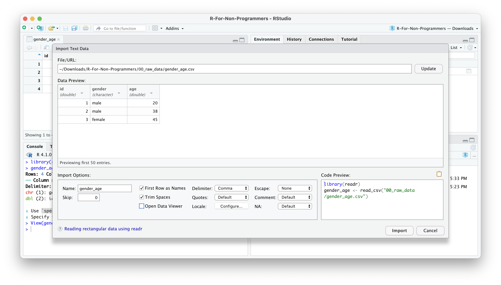
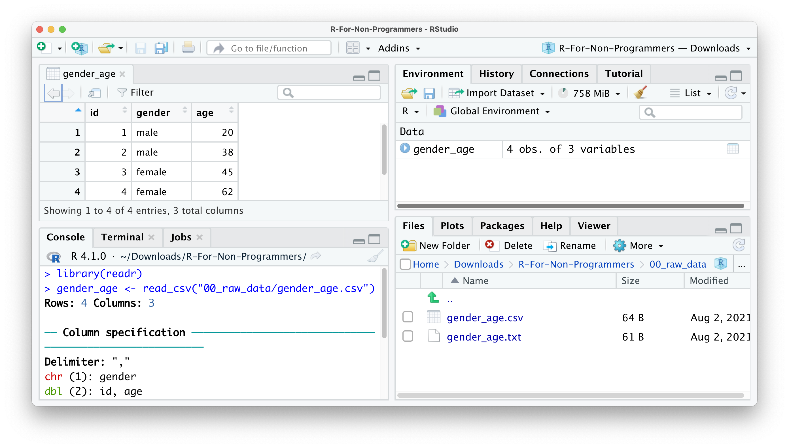

```{r TEMP, echo=FALSE}
library(tidyverse)

# Use this code to truncate output, specified as 'out.lines = n'
# save the built-in output hook
hook_output <- knitr::knit_hooks$get("output")

# set a new output hook to truncate text output
knitr::knit_hooks$set(output = function(x, options) {
  if (!is.null(n <- options$out.lines)) {
    x <- xfun::split_lines(x)
    if (length(x) > n) {
      # truncate the output
      x <- c(head(x, n), "....\n")
    }
    x <- paste(x, collapse = "\n")
  }
  hook_output(x, options)
})
```

# Data Wrangling

You collected your data over months (and sometimes years) and all you really want to know is whether your data makes sense and reveals something nobody would have ever expected. However, before we can truly go ahead with our analysis, it is essential to understand whether our data is 'tidy'. Very often, data we receive is everything else but clean and we need to not only check whether our data is fit for analysis, but also ensure it is in a format that is easy to handle and work with. For small datasets, this is usually a brief exercise. However, I found myself cleaning data for a month, because the dataset was spread out into multiple spreadsheets (no pun intended) with different numbers of columns and odd column names. Thus, data cleaning or data wrangling is an essential first step in any data analysis. It is a step that cannot be skipped and has to be performed on every new dataset.

Luckily, R provides many useful functions to make our lives easier. If you are like me and used to do this in Excel, you will be in for a treat. It is a lot simpler using R to do achieve a clean dataset.

Here is an overview of the different steps we usually work through before we can start with our main analysis. This is list is certainly not exhaustive:

-   Data import

-   Checking data types

-   Recoding and arranging factors, i.e. categorical data.

-   Running missing data diagnostics

-   and other things

## Import your data

The `r4np` package hosts a number of different datasets to work with, but at some point you might want to apply your R knowledge to your own data. Therefore, an important first step is to import your data into RStudio. There are three different methods all of which are very handy:

1.  Click on your data file in the Files pane and choose \`Import Dataset'.

2.  Use the `Import Dataset` button in the Environment pane.

3.  Import your data calling one of the `readr` functions in the console or RScript

### Import data from the Files pane

This approach is by far the easiest. Let's assume you have a dataset called `gender_age.csv` in your `00_raw_data` folder. If you wish to import it, you can do the following:

1.  Click on the name of the file

2.  Select `Import Dataset`.

    

3.  A new window will open and you can choose different options. You also see a little preview of how the data looks like. This is great if you are not sure whether you did it correctly.

    

4.  You can make changes to how the data should be imported, but in most cases the default should be fine. Here is quick breakdown of the most important options:

    -   `Name` allows you to change the object name, i.e. the name of the object this data will be assigned to. I tend to use `df_raw` (`df` stand for `dataframe`, which is how R calls such rectangular datasets).

    -   `Skip` is useful if your data file starts with a number of empty rows at the top. You can remove them here.

    -   `First Row as Names` is ticked by default. In most Social Science projects we tend to have the name of the variables as the first row in your dataset.

    -   `Trim Spaces` removes any unnecassry white-space in your dataset. Leave it ticked.

    -   `Open Data Viewer` allows you to look at your imported dataset. I use it rarely, but it can be helpful at times.

    -   `Delimiter` defines how your columns are separate from each other in your file. If it is a `.csv` it would imply it is a 'comma-separated value', i.e. `,`. This can be changed for different files, depending on how your data is delimited. You can even use the option `Other…` to specify a custom separation option.

    -   `NA` specifies how missing values in your data are acknowledged. By default, empty cells in your data will be recognised as missing data.

    

5.  Once you are happy with your choices, you can click on `Import`.

6.  You will find your dataset in the Environment pane.

    

In the console you can see that R also provides the `Column specification`, which we need later when inspecting 'data types'. `readr` automatically imports all text-based columns as `chr`, i.e. `character` values. However, this might not be always true. More on this aspect of data wrangling in Chapter \@ref(change-data-types).

`CONTINUE FROM HERE`

To achieve this we rely on `readr` from the `tidyverse` package. It can install a range of different datatypes, including `.csv`, `.tsv`, `.txt`. If you want to import data from an `.xlsx` file you have to use another package called `readxl`.

Here are some examples of how you can use `readr` to import your data. The first part is only there to create the two

```{r Importing data with readr, echo=TRUE, message=FALSE, eval=FALSE}
# Load 'readr' via 'tidyverse' or just 'readr
library(tidyverse)

# Import data from '.csv'
read_csv("00_raw_data/gender_age.csv")

# Import data from any file text file by defining the separator yourself
read_delim("00_raw_data/gender_age.txt", delim = "|")
```

## Inspecting your raw data {#inspecting-raw-data}

For the rest of this chapter, we will use the `wvs` dataset from the `r4np` package. However, we do not know much about this dataset and therefore we cannot ask any research questions worth investigating. The first method of inspecting the data is to simply type the name of the object, i.e. `wvs`.

```{r Open wvs, echo=TRUE, message=FALSE}
# Ensure you loaded the 'r4np' package first
library(r4np)

# Show the data in the console
wvs
```

The result is a series of rows and columns. The first information we receive is: `A tibble: 69,578 x 9`. This indicates that our dataset has 69,578 observations (i.e. rows) and 9 columns (i.e. variables). This rectangular format is the one we encounter most frequently in Social Sciences (and probably beyond). If you ever worked in Microsoft Excel, this format will look familiar.

Even though it might be nice to look at this dataset in this way, it is not particularly useful. Depending on your monitor size you might only see a small number of columns and therefore we do not get to see a complete list of variables. All in all, we hardly ever will find much use in inspecting data this way. Luckily there are other functions that can help us.

If you want to see each variable covered in the dataset and their data types, you can use the function `glimpse()` from the `dplyr` package (which is loaded when use load the `tidyverse` package).

```{r Using the glimpse() function, echo=TRUE}
glimpse(wvs)
```

The output of glimpse shows us the name of each column/variable after the `$`, for example `` `Participant ID` ``. The `$` is used to look up certain variables in our dataset. If we want to inspect the column `relationship_status` only, we could write the following:

```{r Inspect Gender in wvs dataset, echo=TRUE, out.lines = 4}
wvs$relationship_status
```

After the variable name we find the recognised datatype for each column in `<...>`, for example `<chr>`. We will return to data types in Chapter \@ref(change-data-types). Lastly, we get examples of the data that is included. This output is much more helpful.

I use `glimpse()` very frequently for different purposes, for example:

-   to understand what variables are included in a dataset,

-   to check correctness of data types,

-   to inspect variable names for typos or unconventional names,

-   to look up variable names.

There is one more way to inspect your data and receive a lot more information about it by using a specialised R package. The `skimr` package is excellent in 'skimming' your dataset. It provides not only information about variable names and data types, but also provides some descriptive statistics. If you installed the `r4np` package and called the function `install_r4np()`, you will have `skimr` installed already.

```{r Using skimr to inspect data sets, echo=TRUE, eval=FALSE}
skimr::skim(wvs)
```

The output in the console should look like this:


As you can tell, there is a lot more information in this output. Many descriptive statistics that could be useful are already displayed. `skim()` provides a summary of the dataset first and then sorts the variables automatically by data type. Depending on the data type you also receive different descriptive statistics. As an added bonus, the function also provides a histogram for numeric variables. However, there is one main problem: Some of the numeric variables are actually not numeric: `Participant ID` and `Gender`. Thus, we will have to correct the data types in a moment.

Inspecting your data in this way can be helpful to get a better understanding of what your data includes and spot problems with it. If you receive data from someone else, these methods are a good way to familiarise yourself with the dataset relatively quickly. Since this particular dataset was prepared for this book, I also made sure I provide documentation for it. You can access it by using `?wvs` in the Console. This will open the documentation in the Help pane. Such documentation can be found for every dataset we use in this book.

## Cleaning your column names: Call the `janitor` {#colnames-cleaning}

If you have an eagle eye, you might have noticed that most of the variable names in `wvs` are not consistent or easy to read/use.

``` {#messy_column_names .r}
# Whitespace and capital letters
Participant ID        
Country Code          
Country name          
Gender                
Age                   

# Difficult to read
YearOfBirth           
Freedom.of.Choice     
Satisfaction-with-life
```

From Chapter \@ref(coding-etiquette), you will remember that being consistent in the way your write your code and name your objects is essential. The same applies, of course, to variable names. R will not break using the existing names, but it will save you a lot of frustration if we take a minute to clean the name and make them more consistent.

You are probably thinking: This is easy, I just open the dataset in Excel and change all the column names. Indeed, it would be a viable and easy option, but it is not very efficient. Instead, we can make use of the `janitor` package. By definition, `janitor` is a package that helps to clean up whatever needs cleaning. In our case we want to tidy our column names. We can use the function `clean_names()` to achieve this. We store the result in a new object called `wvs` to keep those changes. The object will also show up in our Environment pane.

```{r Cleaning column names with janitor, echo=TRUE}
wvs <- janitor::clean_names(wvs)
glimpse(wvs)
```

Now that `janitor` has done its magic, we suddenly have easy to read variable names that are consistent with the 'Tidyverse style guide' [@wickham-2021].

If, for whatever reason, the variable names are still not looking the way you want, you can use the function `rename()` from the `dplyr` package.

```{r Use rename() function, echo=TRUE}
wvs <- wvs %>% rename(satisfaction = satisfaction_with_life)

glimpse(wvs)
```

You are probably wondering what `%>%` stands for. This symbol is called a *'piping operator'* and it allows you to chain multiple functions together by considering the output of the previous function. So, do not confuse `<-` with `%>%`. Each serves a different purpose. The `%>%` has become synonymous with the `tidyverse` approach to R programming and is the chosen approach for this book. Many functions from the `tidyverse` are designed to be chained together.

If we wanted to spell out what we just did we could say:

1.  `wvs <-`: We assigned whatever happened to the right of the assign operator to the object `wvs`.

2.  `wvs %>%`: We defined the dataset we want to use with the functions defined after the `%>%`.

3.  `rename(satisfaction = satisfcation_with_life)`: We define a new name `satisfaction` for the column `satisfaction_with_life`. Notice that the order is `new_name = old_name`. Here we also use `=`. A rare occasion where it makes sense to do so.

Since you will be using the pipe operator very frequently, it is a good idea to remember the keyboard shortcut for it: `Ctrl+Shift+M` for PC and `Cmd+Shift+M` for Mac.

## Data types: What are they and how can you change them {#change-data-types}

When we inspected our data, I mentioned that some of the variables do not have the correct data type. You might be familiar with different data types by classifying them as:

-   *Nominal data*, which is categorical data of no particular order,

-   *Ordinal data*, which is categorical data with a defined order, and

-   *Quantitative data*, which is data that usually is represented by numeric values.

In R we have a slightly different distinction:

-   `character` / `<chr>`: Textual data, for example the text of a tweet.

-   `factor` / `<fct>`: Categorical data with a finite number of categories with no particular order.

-   `ordered` / `<ord>`: Categorical data with a finite number of categories with a particular order.

-   `double` / `<dbl>`: Numerical data with decimal places.

-   `integer` / `<int>`: Numerical data with whole numbers only (i.e. no decimals).

-   `logical` / `<lgl>`: Logical data, which only consists of values 'TRUE' and 'FALSE'.

-   `date` / `date`: Data which consists dates, e.g. '2021-08-05'.

-   `date-time` / `dttm`: Data which consists dates and times, e.g. '2021-08-05 16:29:25 BST'.

For a complete list of data types I recommend to take a look at ['Column Data Types'](https://tibble.tidyverse.org/articles/types.html "'Column Data Types'"){target="blank"} [@data-types-2021].

It is obvious that R has a more fine-grained categorisation of data types. The most important distinction, though, lies between `<chr>`, `<fct>`/`<ord>` and `<dbl>` for most datasets in the Social Sciences. Still, it is good to be aware of what the abbreviations in your `tibble` mean and how they might affect your analysis.

Now that we have a solid understanding of different data types, we can have a look at our dataset and see whether `readr` classified our variables correctly.

```{r Look at wvs again to check data types, echo=TRUE}
glimpse(wvs)
```

`readr` did a great job in identifying all the numeric variables. However, by default, `readr` imports all variables that include text as `<chr>`. It appears, in our dataset this is not quite correct. The variables `country_code`, `countr_name`, `gender` and `relationship_status` specify a finite number of categories. Therefore they should be classified as `factor`. The variable `participant_id` is represented by numbers, but its meaning is also rather categorical in nature. We would not use the ID numbers of participants to perform additions or multiplications. This would simply make no sense. Therefore, it might be wise to turn them into a `factor` as well, even though we likely will not use it in our analysis and would make no difference. However, I am a stickler for those kind of things, so I would include in it.

In order to perform the conversion we need to use two new functions from `dplyr`:

-   `mutate()`: Changes, i.e. 'mutates', a variable.

-   `as_factor()`: Converts data from one type into a `factor`.

If we want to convert all variables in one go, we can put them all into the same function, separated by a `,`.

```{r Convert dataypes, echo=TRUE}
wvs <- wvs %>%
  mutate(country_code = as_factor(country_code),
         country_name = as_factor(country_name),
         gender = as_factor(gender),
         relationship_status = as_factor(relationship_status),
         participant_id = as_factor(participant_id)
  )

glimpse(wvs)
```

The output in the console shows that we successfully performed the transformation and our data types are as we intended them to be. Mission accomplished.

## Recoding factors (e.g. gender coded as 0 and 1)

Another common problem we have to tackle when working with data is their representation in the dataset. For example, `gender` could be measured as `male` and `female`[^data_wrangling-1] or as `0` and `1`. R does not mind which way you represent your data, but some other software does. Therefore, when we import data from somewhere else the values of a variable might not look the way we want. The practicality of having your data represented accurately as what they are becomes obvious when you intend to create tables and plots.

[^data_wrangling-1]: A sophisticated research project would likely not rely on a dichotomous approach to gender, but appreciate the diversity in this regard.

For example, we might be interested to know how many participants in the `wvs` were `male` and how many were `female`. The function `count()` from `dplyr` does exactly that.

```{r Count male and female participants, echo=TRUE}
wvs %>% count(gender)
```

Now we know how many people were `male` and `female` and how many did not disclose their `gender`. Or do we? The issue here is that you would have to know what the `0` and `1` stand for. Surely you would have a coding manual that gives you the answer, but it seems a bit of a complication. For `gender`, this might still be easy to remember, but can you recall the numbers for 48 countries?

It certainly would be easier to replace the `0`s and `1`s with their corresponding labels. This can be achieved with a simple function called `fct_recode()` from `forcats`. Since we 'mutate' a variable into something else, we have to use the `mutate()` function too.

```{r Recode gender, echo=TRUE}
wvs <- wvs %>% mutate(gender = fct_recode(gender, "male" = "0", "female" = "1"))
```

If you have been following along very carefully you might spot one oddity in this code: `"0"` and `"1"`. You likely recall that in Chapter \@ref(r-basics-the-very-fundamentals) I mentioned that we use `""` for `character` values but not for numbers. What happens if we run the code and remove `""`.

```{r Recode gender without quotation marks, echo=TRUE, error=TRUE}
wvs %>% mutate(gender = fct_recode(gender, "male" = 0, "female" = 1))
```

The error message is very easy to understand: `fct_recode()` only expects `strings` as input and not numbers. R recognises `0` and `1` as numbers, but `fct_recode()` converts a `factor` value into another `factor` value. To refer to a factor level (i.e. one of the categories in our factor), we have to use `""`. In other words, data types matter and are often a source of problems with your code. Thus, always pay close attention to it.

If we rerun our analysis from before and generate a frequency table for `gender`, we now get a much more readable output.

```{r Frequency table for gender with proper labels, echo=TRUE}
wvs %>% count(gender)
```

Another benefit of going through the trouble of recoding your factors is the readability of your plots. We could easily generate a bar plot based on the above table and have appropriate labels, instead of `0` and `1`.

```{r Barplot for gender, echo=TRUE}
wvs %>% count(gender) %>% 
  ggplot(aes(gender, n)) + 
  geom_col()
```

Plots are an excellent way to explore your data and understand relationships between variables. More about this when we start to perform analytical steps on our data (see Chapter \@ref(descriptive-statistics) and beyond).

## Dealing with missing data

## Latent constructs and their reliability

### Theory

### Visualisation

### Computation
