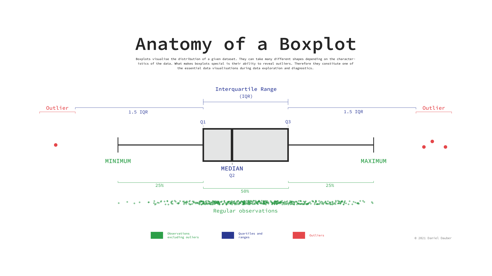
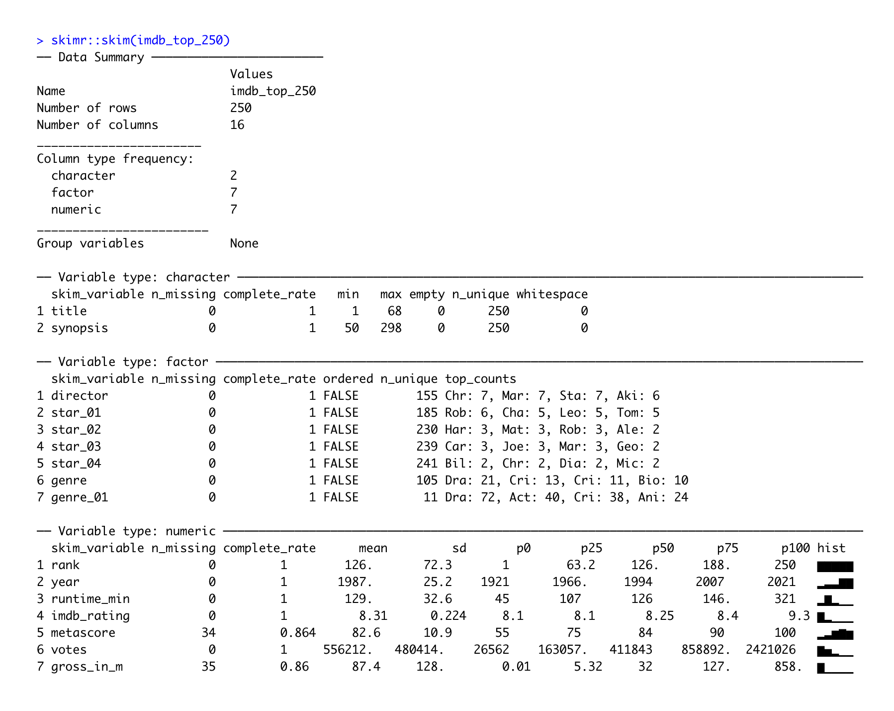

# (PART) Analysis {-}

# Descriptive Statistics {#descriptive-statistics}

```{r, include=FALSE}
library(tidyverse)
library(r4np)
library(patchwork)
```

The best way to understand how participants in your study have responded to various questions or experimental treatments is to use *descriptive statistics*. As the name indicates, their main purpose is to 'describe'. Most of the time, we want to describe the composition of our sample and how the majority (or minority) of participants performed.

In contrast, we use *inferential statistics* to make predictions. In Social Sciences, we are often interested in predicting how people will behave in certain situations and scenarios. We aim to develop models that help us navigate the complexity of social interactions that we all engage in but might not fully understand. We cover *inferential statistics* in later chapters of this book.

In short, descriptive statistics are an essential component to understand your data. To some extent, one could argue that we were already describing our data when we performed various data wrangling tasks (see Chapter \@ref(data-wrangling)). The following chapters focus on essential descriptive statistics, i.e. those you likely want to investigate in 99.9 out of 100 research projects.

This book takes a 'visualised' approach to data analysis. Therefore, each section will entail data visualisations and statistical computing. A key learning outcome of this chapter is to plot your data using the package `ggplot2` and present your data's characteristics in different ways. Each chapter will ask questions about our dataset that we aim to answer visually and computationally. However, first, we need to understand how to create plots in *R*.

## Plotting in *R* with `ggplot2` {#plotting-in-r-with-ggplot2}

Plotting can appear intimidating at first but is very easy and quick once you understand the basics. The `ggplot2` package is a very popular package to generate plots in *R*, and many other packages are built upon it. This makes it a very flexible tool to create almost any data visualisation you could imagine. If you want to see what is possible with `ggplot2`, you might want to consider looking at [#tidytuesday](https://twitter.com/search?q=%23tidytuesday "#tidytuesday"){target="blank"} on Twitter, where novices and veterans share their data visualisations every week.

To generate any plot, we need to define three components at least:

-   a dataset,

-   variables we want to plot, and

-   a function to indicate how we want to plot them, e.g. as lines, bars, points, etc.

Admittedly, this is a harsh oversimplification, but it will serve as a helpful guide to get us started. The function `ggplot()` is the one responsible for creating any type of data visualisation. The generic structure of a `ggplot()` looks like this:

::: {#basic_ggplot_structure align="center"}
ggplot(data, aes(x = variable_01, y = variable_02))
:::

In other words, we first need to provide the dataset `data`, and then the aesthetics (`aes()`). Think of `aes()` as the place where we define our variables (i.e. `x` and `y`). For example, we might be interested to know which movie genre is the most popular among the top 250 IMDb movies. The dataset `imdb_top_250` from the `r4np` package allows us to find an answer to this question. Therefore we define the components of the plot as follows:

-   our data is `imdb_top_250`, and

-   our variable of interest is `genre_01`.

```{r Most popular genre incomplete plot, echo=TRUE}
ggplot(imdb_top_250, aes(x = genre_01))
```

Running this line of code will produce an empty plot. We only get labels for our x-axis since we defined it already. However, we have yet to tell `ggplot()` how we want to represent the data on this canvas. Your choice for how you want to plot your data is usually informed by the type of data you use and the statistics you want to represent. For example, plotting the mean of a factor is not meaningful, e.g. computing the mean of movie genres. On the other hand, we can count how often specific genres appear in our dataset. One way of representing a factor's count (or frequency) is to use a bar plot. To add an element to `ggplot()`, i.e. bars, we use `+` and append the function `geom_bar()`, which draws bars. The `+` operator works similar to `%>%` and allows to chain multiple functions one after the other as part of a `ggplot()`.

```{r Most popular genre with barplot, echo=TRUE}
ggplot(imdb_top_250, aes(x = genre_01)) +
  geom_bar()
```

With only two lines of coding, we created a great looking plot. We can see that `Drama` is by far the most popular genre, followed by `Action` and `Crime`. Thus, we successfully found an answer to our question. Still, there are more improvements necessary to use it in a publication.

We can use `+` to add other elements to our plot, such as a title and proper axes labels. Here are some common functions to further customise our plot:

```{r Most popular genre with barplot and extras, echo=TRUE}
ggplot(imdb_top_250, aes(x = genre_01)) +
  geom_bar() +
  ggtitle("Most popular movie genres") +  # Add a title
  xlab("movie genre") +                   # Rename x-axis
  ylab("frequency")                       # Rename y-axis
```

When working with factors, the category names can be rather long. In this plot, we have lots of categories, and the labels `Adventure`, `Animation`, and `Biography` are a bit too close to each other for my taste. This might be an excellent opportunity to use `coord_flip()`, which rotates the entire plot by 90 degrees, i.e. turning the x-axis into the y-axis and vice versa. This makes the labels much easier to read.

```{r Most popular genre with barplot and extras and formatting, echo=TRUE}
ggplot(imdb_top_250, aes(x = genre_01)) +
  geom_bar() +
  ggtitle("Most popular movie genres") +
  xlab("movie genre") +
  ylab("frequency") +
  coord_flip()
```

Our plot is almost perfect, but we should take one more step to make reading and understanding this plot even easier. At the moment, the bars are ordered alphabetically by movie genre. Unfortunately, this is hardly ever a useful way to order your data. Instead, we might want to sort the data by frequency, showing the most popular genre at the top. To achieve this, we could either sort the movies by hand (see Chapter \@ref(reordering-factor-levels) or slightly amend what we have coded so far.

The problem you encounter when rearranging a `geom_bar()` with only one variable is that we do not have an explicit value to indicate how we want to sort the bars. Our current code is based on the fact that `ggplot` does the counting for us. So, instead, we need to do two things:

-   create a table with all genres and their frequency, and

-   use this table to plot the genres by the frequency we computed

```{r Most popular genre with barplot and extras step-by-step, echo=TRUE}
# Step 1: The frequency table only
imdb_top_250 %>%
  count(genre_01)
```

```{r}
# Step 2: Plotting a barplot based on the frequency table
imdb_top_250 %>%
  count(genre_01) %>%
  ggplot(aes(x = genre_01, y = n)) +

  # Use geom_col() instead of geom_bar()
  geom_col() +
  
  # Add titles for plot
  ggtitle("Most popular movie genres") +
  xlab("movie genre") +
  ylab("frequency") +
  
  # Rotate plot by 180 degrees
  coord_flip()
```

```{r}
#Step 3: reorder() genre_01 by frequency, i.e. by 'n'
imdb_top_250 %>%
  count(genre_01) %>%
  ggplot(aes(x = reorder(genre_01, n), y = n)) +  # Use 'reorder()'
  geom_col() +
  ggtitle("Most popular movie genres") +
  xlab("movie genre") +
  ylab("frequency") +
  coord_flip()
```

Step 3 is the only code you need to create the desired plot. The other two steps only demonstrate how one can slowly build this plot, step-by-step. You might have noticed that I used `dplyr` to chain all these functions together (i.e. `%>%`), and therefore, it was not necessary to specify the dataset in `ggplot()`.

There are also two new functions we had to use: `geom_col()` and `reorder()`. The functions `geom_col()` and `geom_bar()` can be confusing. The easiest way to remember how to use them is: If you use a frequency table to create your barplot, use `geom_col()`, if not, use `geom_bar()`. The function `geom_col()` requires that we specify a y-axis (our frequency scores), while `geom_bar()` does not.

In many cases, when creating plots, you have to perform two steps:

-   generate the statistics you want to plot, e.g. a frequency table, and

-   plot the data via `ggplot()`

Now you have learned the fundamentals of plotting in *R*. We will create a lot more plots throughout the next chapters. They all share the same basic structure, but we will use different `geom_`s to describe our data. By the end of this book, you will have accrued enough experience in plotting in *R* that it will feel like second nature. If you want to deepen your knowledge of `ggplot`, you should take a look at the book ['ggplot: Elegant Graphics for Data Analysis'](https://ggplot2-book.org "'ggplot: Elegant Graphics for Data Analysis'"){target="blank"} or ['R Graphics Cookbook'](https://r-graphics.org "'R Graphics Cookbook'"){target="blank"} which moves beyond `ggplot2`. Apart from that, you can also find fantastic packages which extend the range of *'geoms'* you can use in the ['ggplot2 extensions gallery'](https://exts.ggplot2.tidyverse.org/gallery/ "'ggplot2 extensions gallery'"){target="blank"}.

## Central tendency measures: Mean, Median, Mode {#central-tendency}

The mean, median and mode (the 3 Ms) are all measures of central tendency, i.e. they provide insights into how our data is distributed. All three of these measures summarise our data/variable by a single score which can be helpful but sometimes also terribly misleading.

### Mean

The mean is likely the most known descriptive statistics and, at the same time, a very powerful and influential one. For example, the average ratings of restaurants on Google might influence our decision on where to eat out. Similarly, we might consider the average rating of movies to decide which one to watch in the cinema with friends. Thus, what we casually refer to as the *'average'* is equivalent to the *'mean'*.

In *R*, it is simple to compute the mean using the function `mean()`. We used this function in Chapter \@ref(functions) and Chapter \@ref(latent-constructs) already. However, we have not looked at how we can plot the mean.

Assume we are curious to know how successful movies are in each of the genres. The mean could be a good starting point to answer this question because it provides the *'average'* success of movies in a particular genre. The simplest approach to investigating this is using a bar plot, like in Chapter \@ref(plotting-in-r-with-ggplot2). So, we first create a tibble that contains the means of `gross_in_m` (i.e. the financial success fo a movie) for each genre in `genre_01`. Then we use this table to plot a bar plot with `geom_col()`.

```{r Plotting the mean of movie genre earnings, echo=TRUE}
imdb_top_250 %>%
  
  # Group data by genre
  group_by(genre_01) %>%
  
  # Compute the mean for each group (remove NAs via na.rm = TRUE)
  summarise(mean_earnings_in_m = mean(gross_in_m, na.rm = TRUE)) %>%
  
  # Create the plot
  ggplot(aes(x = reorder(genre_01, mean_earnings_in_m), y = mean_earnings_in_m)) +
  geom_col() +
  coord_flip()
```

You will have noticed that we use the function `summarise()` instead of `mutate()`. The `summarise()` function is a special version of `mutate()`. While `mutate()` returns a value for each row, summarise condenses our dataset, e.g. turning each row of observations into scores for each genre. Here is an example of a simple dataset which illustrates the difference between these two functions.

```{r, echo=TRUE}
# Create a simple dataset from scratch with tibble()
(data <- tibble(number = c(1, 2, 3, 4, 5),
               group = factor(c("A", "B", "A", "B", "A"))))
```

```{r}
# Return the group value for each observation/row
data %>%
  group_by(group) %>%
  mutate(sum = sum(number))
```

```{r}
# Returns the group value once for each group
data %>%
  group_by(group) %>%
  summarise(sum = sum(number))
```

Considering the results from our plot, it appears as if `Action` and `Animation` are far ahead of the rest. On average, both make around 200 million per movie. `Adventure` ranks third with only approximately 70 million. We can retrieve the exact earnings by removing the plot from the above code.

```{r Earnings by movie genre as tibble, echo=TRUE}
imdb_top_250 %>%
  group_by(genre_01) %>%
  summarise(mean_earnings_in_m = mean(gross_in_m, na.rm = TRUE)) %>%
  arrange(desc(mean_earnings_in_m))
```

In the last line, I used a new function called `arrange()`. It allows us to sort rows in our dataset by a specified variable (i.e. a column). By default, `arrange()` sorts values in ascending order, putting the top genre last. Therefore, we have to use another function to change the order to descending with `desc()`. So now the top-genre is listed at the top. The function `arrange()` works similarly to `reorder()` but is used for sorting variables in data frames and less so for plots.

Based on this result, we might believe that `Action` and `Animation` movies are the most successful genres. However, we have not taken into account how many movies there are in each genre. Consider the following example:

```{r Example why counts matter when computing the mean, echo=TRUE}
# Assume there are 2 Action movies in the top 250
# both of which earn 203 million
2 * 203
```

```{r}
# Assume there are 10 Drama movies in the top 25
# each of which earns 53 million
10 * 53
```

Thus, the *'mean'* alone might not be a good indicator. It can tell us which genre is most successful based on a single movie, but we also should consider how many movies there are in each genre.

Let's add the number of movies (`n`) in each genre to our table. We can achieve this by using the function `n()`.

```{r Earning by genre plus number of movies in each genre, echo=TRUE}
imdb_top_250 %>%
  group_by(genre_01) %>%
  summarise(mean_earnings_in_m = mean(gross_in_m, na.rm = TRUE),
            n = n()) %>%
  arrange(desc(mean_earnings_in_m))
```

Our interpretation might slightly change based on these findings. There are considerably more movies in the genre `Drama` than in `Action` or `Animation`. We already plotted the frequency of movies per genre in Chapter \@ref(plotting-in-r-with-ggplot2). Accordingly, we would have to think that `Drama` turns out to be the most successful genre if we consider the number of movies listed in the IMDb top 250.

As a final step, we can plot the sum of all earnings per genre as yet another indicator for the 'most successful genre'.

```{r Compute sum of earnings per genre, echo=TRUE}
imdb_top_250 %>%
  filter(!is.na(gross_in_m)) %>%
  group_by(genre_01) %>%
  summarise(sum_gross_in_m = sum(gross_in_m)) %>%
  ggplot(aes(x = genre_01, y = sum_gross_in_m)) +
  geom_col() +
  coord_flip()
```

These results confirm that the `Action` genre made the most money out of all genres covered by the top 250 IMDb movies. I am sure you are curious to know which action movie contributed the most to this result. We can achieve this easily by drawing on functions we already know.

```{r Which action movie is the most successful one, echo=TRUE}
imdb_top_250 %>%
  select(title, genre_01, gross_in_m) %>%
  filter(genre_01 == "Action") %>%
  slice_max(order_by = gross_in_m,
            n = 5)
```

`Avengers: Endgame` and `Avengers: Infinity` war rank the highest out of all `Action` movies. Two incredible movies if you are into Marvel comics.

In the last line, I sneaked in another new function from `dplyr` called `slice_max()`. This function allows us to pick the top 5 movies in our data. So, if you have many rows in your data frame (remember there are 40 action movies), you might want to be 'picky' and report only the top 3, 4 or 5. As you can see, `slice_max()` requires at least to arguments: `order_by` which defines the variable your dataset should be sorted by, and `n` which defines how many rows should be selected, e.g. `n = 3` for the top 3 movies or `n = 10` for the Top 10 movies. If you want to pick the lowest observations in your dataframe, you can use `slice_min()`. There are several other 'slicing' functions that can be useful and can be found on the corresponding [dplyr website](https://dplyr.tidyverse.org/reference/slice.html "dplyr website"){target="blank"}.

In conclusion, the mean helps understand how each movie, on average, performed across different genres. However, the mean alone provides a somewhat incomplete picture. Thus, we need to always look at means in the context of other information to gain a more comprehensive insight into our data.

### Median

The *'median'* is the little, for some, lesser-known and used brother of the *'mean'*. However, it can be a powerful indicator for central tendency because it is not so much affected by outliers. With outliers, I mean observations that lie way beyond or below the average observation in our dataset. Let's inspect the `Action` genre more closely and see how each movie in this category performed relative to each other. We first `filter()` our dataset to only show movies in the genre `Action` and also remove responses that have no value for `gross_in_m` using the opposite (i.e. `!`) of the function `is.na()`.

```{r Earnings of action movies barplot, echo=TRUE}
imdb_top_250 %>%
  filter(genre_01 == "Action" & !is.na(gross_in_m)) %>%
  ggplot(aes(x = reorder(title, gross_in_m),
             y = gross_in_m)) +
  geom_col() +
  coord_flip()
```

`Avengers: Endgame` and `Avengers: Infinity War` are far ahead of any other movie. We can compute the mean with and without these two movies by adding the titles of the movies as a filter criterion.

```{r Compute mean for action genre with and without Avengers movies, echo=TRUE}
# Mean earnings for Action genre with Avengers movies
imdb_top_250 %>%
  filter(genre_01 == "Action") %>%
  summarise(mean = mean(gross_in_m, na.rm = TRUE))
```

```{r}
# Mean earnings for Action genre with Avengers movies
imdb_top_250 %>%
  filter(genre_01 == "Action" &
           title != "Avengers: Endgame" &
           title != "Avengers: Infinity War") %>%
  summarise(mean = mean(gross_in_m, na.rm = TRUE))
```

The result is striking. Without these two movies, the `Action` genre would have fewer earnings per movie than the `Animation` genre. However, if we computed the median instead, we would not notice such a massive difference in results. This is because the median sorts a dataset, e.g. by `gross_in_m` and then picks the value that would cut the data into two equally large halves. It does not matter which value is the highest or lowest in our dataset. What matters is the value that is ranked right in the middle of all values. The median splits your dataset into two equally large datasets.

```{r Compute median for action genre with and without Avengers movies, echo=TRUE}
# Median earnings for Action genre with Avengers movies
imdb_top_250 %>%
  filter(genre_01 == "Action") %>%
  summarise(median = median(gross_in_m, na.rm = TRUE))
```

```{r}
# Median earnings for Action genre with Avengers movies
imdb_top_250 %>%
  filter(genre_01 == "Action" &
           title != "Avengers: Endgame" &
           title != "Avengers: Infinity War") %>%
  summarise(median = median(gross_in_m, na.rm = TRUE))
```

Both medians are much closer to each other, showing how much better suited the median is in our case. In general, when we report means, it is advisable to report the median as well. If a mean and median differ substantially, it could imply that your data 'suffers' from outliers. So we have to detect them and think about whether we should remove them for further analysis (see Chapter \@ref(dealing-with-outliers).

We can visualise medians using boxplots. Boxplots are a very effective tool to show how your data is distributed in one single data visualisation, and it offers more than just the mean. It also shows the spread of your data (see Chapter \@ref(spread-of-data)).

```{r Boxplot for action movies, echo=TRUE}
imdb_top_250 %>%
  filter(genre_01 == "Action" & !is.na(gross_in_m)) %>%
  ggplot(aes(gross_in_m)) +
  geom_boxplot()
```

To interpret this boxplot consider Figure \@ref(fig:anatomy-of-a-boxplot). Every boxplot consists of a 'box' and two whiskers (i.e. the lines leading away from the box). The distribution of data can be assessed by looking at different ranges:

-   `MINIMUM` to `Q1` represents the bottom 25% of our observations,

-   `Q1` to `Q3`, also known as the `interquartile range` (IQR) defines the middle 50% of our observations, and

-   `Q3` to `MAXIMUM`, contains the top 25% of all our data.

Thus, with the help of a boxplot, we can assess whether our data is evenly distributed across these ranges or not. If observations fall outside a certain range (i.e. `1.5 IQR`) they are classified as outliers. We cover outliers in great detail in Chapter \@ref(dealing-with-outliers).

```{r anatomy of a boxplot, fig.cap = "Anatomy of a Boxplot", label = "anatomy-of-a-boxplot", echo=FALSE}

```

Considering our boxplot, it shows that we have one observation that is an outlier, which is likely `Avengers: Endgame`, but what happened to the other Avengers movie? Is it not an outlier as well? It seems we need some more information. We can overlay another `geom_` on top to visualise where precisely each movie lies on this boxplot. We can represent each movie as a point by using `geom_point()`. This function requires us to define the values for the x and y-axis. Here it makes sense to set `y = 0,` which aligns all the dots in the middle of the boxplot.

```{r Boxplot plus geom_point for action movies, echo=TRUE}
imdb_top_250 %>%
  filter(genre_01 == "Action" & !is.na(gross_in_m)) %>%
  ggplot(aes(gross_in_m)) +
  geom_boxplot() +
  geom_point(aes(y = 0, col = "red"),
             show.legend = FALSE)
```

To make the dots stand out more, I changed the colour to `"red"`. By adding the `col` attributed (`color` and `colour` also work), `ggplot2` would automatically generate a legend. Since we do not need it, we can specify it directly in the `geom_point()` function. If you prefer the legend, remove `show.legend = FALSE`.

The two dots on the right are the two Avengers movies. This plot also nicely demonstrates why boxplots are so popular and helpful: They provide so many insights, not only into the central tendency of a variable, but also highlight outliers and, more generally, give a sense of the spread of our data (more about this in Chapter \@ref(spread-of-data)).

The median is an important descriptive and diagnostic statistic and should be included in most empirical quantitative studies.

### Mode {#mode}

Finally, the 'mode' indicates which value is the most frequently occurring value for a specific variable. For example, we might be interested in knowing which IMDb rating was most frequently awarded to the top 250 movies.

When trying to compute the mode in *R*, we quickly run into a problem because there is no function available to do this straight away unless you search for a package that does it for you. However, before you start searching, let's reflect on what the mode does and why we can find the mode without additional packages or functions. The mode is based on the frequency of the occurrence of a value. Thus, the most frequently occurring value would be the one that is listed at the top of a frequency table. We have already created several frequency tables in this book, and we can create another one to find the answer to our question.

```{r The mode, echo=TRUE}
imdb_top_250 %>% count(imdb_rating)
```

We can also easily visualise this frequency table in the same way as before. To make the plot a bit more 'fancy', we can add labels to the bar which reflect the frequency of the rating. We need to add the attribute `label` and also add a `geom_text()` layer to display them. Because the numbers would overlap with the bars, I 'nudge' the labels up by `4` units on the y-axis. Finally, because we treat `imdb_rating` as categories, we should visualise them `as_factor()`s.

```{r The mode visualised as a frequency table, echo=TRUE}
imdb_top_250 %>%
  count(imdb_rating) %>%
  ggplot(aes(x = as_factor(imdb_rating),
             y = n,
             label = n)) +
  geom_col() +
  geom_text(nudge_y = 4)
```

The frequency table and the plot reveal that the mode for `imdb_rating` is `8.1`. In addition, we also get to know how often this rating was applied, i.e. `80` times. This provides much more information than receiving a single score and helps better interpret the importance of the mode as an indicator for a central tendency. Consequently, there is generally no need to compute the mode if you can have a frequency table instead. Still, if you are keen to have a function that computes the mode, you will have to write your own function, e.g. as shown in this post on [stackeroverflow.com](https://stackoverflow.com/questions/2547402/how-to-find-the-statistical-mode "stackeroverflow.com"){target="blank"} or search for a package that coded one already.

As a final remark, it is also possible that you can find two or more modes in your data. For example, if the rating `8.1` appears `80` times and the rating `9.0` appears `80` times, both would be considered a mode.

## Indicators and visualisations to examine the spread of data {#spread-of-data}

Understanding how your data is spread out is essential to get a better sense of what your data is composed of. We already touched upon the notion of spread in Chapter \@ref(median) through plotting a boxplot. Furthermore, the spread of data provides insights into how homogeneous or heterogeneous our participants' responses are. The following will cover some essential techniques to investigate the spread of your data and investigate whether our variables are normally distributed, which is often a vital assumption for specific analytical methods (see Chapter \@ref(sources-of-bias). In addition, we will aim to identify outliers that could be detrimental to subsequent analysis and significantly affect our modelling and testing in later stages.

### Boxplot: So much information in just one box

The boxplot is a staple in visualising descriptive statistics. It offers so much information in just a single plot that it might not take much to convince you that it has become a very popular way to show the spread of data.

For example, we might be interested to know how long most movies run. Our gut feeling might tell us that most movies are probably around two hours long. One approach to finding out is a boxplot, which we used before.

```{r Box plot, fig.cap="A boxplot", label="a-boxplot", echo=TRUE}
# Text for annotations
longest_movie <-
  imdb_top_250 %>%
  filter(runtime_min == max(runtime_min)) %>%
  select(title)

shortest_movie <-
  imdb_top_250 %>%
  filter(runtime_min == min(runtime_min)) %>%
  select(title)

# Create the plot
imdb_top_250 %>%
  ggplot(aes(runtime_min)) +
  geom_boxplot() +
  annotate("text",
           label = glue::glue("{longest_movie}
                              ({max(imdb_top_250$runtime_min)} min)"),
           x = 310,
           y = 0.05,
           size = 2.5) +
  annotate("text",
           label = glue::glue("{shortest_movie}
                              ({min(imdb_top_250$runtime_min)} min)"),
           x = 45,
           y = 0.05,
           size = 2.5)
```

The results indicate that most movies are between 100 to 150 minutes long. Our intuition was correct. We find that one movie is even over 300 minutes long, i.e. over 5 hours: `Gangs of Wasseypur`. In contrast, the shortest movie only lasts 45 minutes and is called `Sherlock Jr.`. I added annotations using `annotate()` to highlight these two movies in the plot. A very useful package for annotations is `glue`, which allows combining text with data to label your plots. So, instead of looking up the longest and shortest movie, I used the `filter()` and `select()` functions to find them automatically. This has the great advantage that if I wanted to update my data, the name of the longest movie might change. However, I do not have to look it up again by hand.

As we can see from our visualisation, both movies would also count as outliers in our dataset (see Chapter \@ref(outliers-iqr).

### Histogram: Do not mistake it as a bar plot

Another frequently used approach to show the spread (or distribution) of data is the histogram. The histogram easily gets confused with a bar plot. However, you would be very mistaken to assume that they are the same. Some key differences between these two types of plots is summarised in Table \@ref(tab:histogram-vs-bar-plot).

+----------------------------------------------------------------------+--------------------------------------------------------------------+
| Histogram                                                            | Bar plot                                                           |
+======================================================================+====================================================================+
| Used to show the distribution of non-categorical data                | Used for showing the frequency of categorical data, i.e. `factor`s |
+----------------------------------------------------------------------+--------------------------------------------------------------------+
| Each bar (also called 'bin') represents a group of observations.     | Each bar represents one category (or level) in our `factor`.       |
+----------------------------------------------------------------------+--------------------------------------------------------------------+
| The order of the bars is important and cannot/should not be changed. | The order of bars is arbitrary and can be reordered if meaningful. |
+----------------------------------------------------------------------+--------------------------------------------------------------------+

: (#tab:histogram-vs-bar-plot) Histogram vs bar plot

Let's overlap a bar plot with a histogram for the same variable to make this difference even more apparent.

```{r Compare histogram with bar plot, echo=TRUE}
imdb_top_250 %>%
  ggplot(aes(runtime_min)) +
  geom_histogram() +
  geom_bar(aes(fill = "red"), show.legend = FALSE)
```

There are a couple of important observations to be made:

-   The bar plot has much shorter bars because each bar represents the frequency of a single unique score. Thus, the runtime of `151` is represented as a bar, as is the runtime of `152`. Only identical observations are grouped together. As such, the bar plot is based on a frequency table, similar to what we computed before.

-   In contrast, the histogram's 'bars' are higher because they group together individual observations based on a specified range, e.g. one bar might represent movies that have a runtime between 150-170 minutes. These ranges are called `bins`.

We can control the number of bars in our histogram using the `bins` attribute. `ggplot` even reminds us in a warning that we should adjust it to represent more details in the plot. Let's experiment with this setting to see how it would look like with different numbers of `bins`.

```{r Histogram with different bins, echo=TRUE, fig.show='hide'}
imdb_top_250 %>%
  ggplot(aes(runtime_min)) +
  geom_histogram(bins = 5) +
  geom_bar(aes(fill = "red"), show.legend = FALSE)

imdb_top_250 %>%
  ggplot(aes(runtime_min)) +
  geom_histogram(bins = 20) +
  geom_bar(aes(fill = "red"), show.legend = FALSE)

imdb_top_250 %>%
  ggplot(aes(runtime_min)) +
  geom_histogram(bins = 60) +
  geom_bar(aes(fill = "red"), show.legend = FALSE)

imdb_top_250 %>%
  ggplot(aes(runtime_min)) +
  geom_histogram(bins = 300) +
  geom_bar(aes(fill = "red"), show.legend = FALSE)
```

```{r Histogram with different bins output, echo=FALSE}
p1 <-
  imdb_top_250 %>%
  ggplot(aes(runtime_min)) +
  geom_histogram(bins = 5) +
  geom_bar(aes(fill = "red"), show.legend = FALSE) +
  ggtitle("bins = 5")

p2 <-
  imdb_top_250 %>%
  ggplot(aes(runtime_min)) +
  geom_histogram(bins = 20) +
  geom_bar(aes(fill = "red"), show.legend = FALSE) +
  ggtitle("bins = 20")

p3 <-
  imdb_top_250 %>%
  ggplot(aes(runtime_min)) +
  geom_histogram(bins = 60) +
  geom_bar(aes(fill = "red"), show.legend = FALSE) +
  ggtitle("bins = 60")


p4 <-
  imdb_top_250 %>%
  ggplot(aes(runtime_min)) +
  geom_histogram(bins = 300) +
  geom_bar(aes(fill = "red"), show.legend = FALSE) +
  ggtitle("bins = 300")

p1 + p2 + p3 + p4
```

As becomes evident, if we select a large enough number of bins, we can achieve the same result as a bar plot. This is the closest a bar plot can become to a histogram, i.e. if you define the number of `bins` so that each observation is captured by one `bin`. While theoretically possible, practically, this rarely makes much sense.

We use histograms to judge whether our data is normally distributed. A normal distribution is often a requirement for assessing whether we can run certain types of analyses or not (for more details, see Chapter \@ref(normality). In short: It is imperative to know about it in advance. The shape of a normal distribution looks like a bell (see Figure \@ref(fig:normal-distribution)). If our data is equal to a normal distribution, we find that

-   the mean and the median are the same value and we can conclude that

-   the mean is a good representation for our data/variable.

```{r Normal distribution, fig.cap="A normal distribution", echo=FALSE, label="normal-distribution"}
data <- tribble(~x, -5, 5)

data %>%
  ggplot(aes(x)) +
  geom_hline(yintercept = 0) +
  geom_vline(xintercept = c(0), col = "#DDDDDD") +
  stat_function(fun = dnorm, n = 200, args = list(mean = 0, sd = 1.5)) +
  scale_y_continuous(breaks = NULL) +
  scale_x_continuous(breaks = NULL) +
  theme_minimal() +
  ylab("")
```

Let's see whether our data is normally distributed using the histogram we already plotted and overlay a normal distribution. The coding for the normal distribution is a little more advanced. Do not worry if you cannot fully decipher its meaning just yet. To draw such a reference plot, we need to:

-   compute the `mean()` of our variable,

-   calculate the standard deviation `sd()` of our variable (see Chapter \@ref(standard-deviation),

-   use the function `geom_func()` to plot it and,

-   define the function `fun` as `dnorm`, which stands for 'normal distribution'.

It is more important to understand what the aim of this task is, rather than fully comprehending the computational side in *R*: we try to compare our distribution with a normal one.

```{r Compare normal distribution to our distribution, echo=TRUE, warning=FALSE}
imdb_top_250 %>%
  ggplot(aes(runtime_min)) +
  geom_histogram(aes(y = ..density..), bins = 30) +

  # The following part creates a normal curve based on
  # the mean and standard deviation of our data

  geom_function(fun = dnorm,
                n = 103,
                args = list(mean = mean(imdb_top_250$runtime_min),
                            sd = sd(imdb_top_250$runtime_min)),
                col = "red")
```

However, there are two problems if we use histograms in combination with a normal distribution reference plot: First, the y-axis needs to be transformed to fit the normal distribution (which is a density plot and not a histogram). Second, the shape of our histogram is affected by the number of `bins` we have chosen, which is an arbitrary choice we make. Besides, the lines of code might be tough to understand because we have to 'hack' the visualisation to make it work, i.e. using `aes(y = ..density..)`. There is, however, a better way to do this: Density plots.

### Density plots: Your smooth histograms

Density plots are a special form of the histogram. It uses 'kernel smoothing', which turns our blocks into a smoother shape. Better than trying to explain what it does, it might help to see it. We use the same data but replace `geom_histogram()` with `geom_density()`. I also saved the plot with the normal distribution in a separate object, so we can easily reuse throughout this chapter.

```{r Density plot vs normal distribution, fig.cap="Density plot vs normal distribution", label="density-vs-normal", echo=TRUE}
# Ingredients for our normality reference plot
mean_ref <- mean(imdb_top_250$runtime_min)
sd_ref <- sd(imdb_top_250$runtime_min)

# Create a plot with our reference normal distribution
n_plot <-
  imdb_top_250 %>%
  ggplot(aes(runtime_min)) +
  geom_function(fun = dnorm,
                n = 103,
                args = list(mean = mean_ref,
                            sd = sd_ref),
                col = "red")

# Add our density plot
n_plot +
  geom_density()
```

We can also define how big the `bins` are for density plots, which make the plot more or less smooth. After all, the density plot is a histogram, but the transitions from one bin to the next are 'smoothed'. Here is an example of how different `bw` settings affect the plot.

```{r Density plot vs normal distribution with different bw settings, echo=TRUE, results='hide'}
# bw = 18
n_plot +
  geom_density(bw = 18) +
  ggtitle("bw = 18")

# bw = 3
n_plot +
  geom_density(bw = 3) +
  ggtitle("bw = 18")
```

```{r Illustration of different bw settings, echo=FALSE}
# bw = 18
p1 <-
  n_plot +
  geom_density(bw = 18) +
  ggtitle("bw = 18")

# bw = 3
p2 <-
  n_plot +
  geom_density(bw = 3) +
  ggtitle("bw = 18")

p1 / p2
```

The benefits of the density plot in this situation are obvious: It is much easier to see whether our data is normally distributed or not when compared to a reference plot. However, we still might struggle to determine normality just by these plots because it depends on how high or low we set `bw`.

### Violin plot: Your smooth boxplot

If a density plot is the sibling of a histogram, the violin plot would be the sibling of a boxplot, but the twin of a density plot. Confused? If so, then let's use the function `geom_volin()` to create one.

```{r Violin plot}
imdb_top_250 %>%
  ggplot(aes(x = runtime_min, y = 0)) +
  geom_violin()
```

Looking at our plot, it becomes evident where the violin plot got its name from, i.e. its shape. The reason why it is also a twin of the density plot becomes clear when we only plot half of the violin with `geom_violinghalf()` from the `see` package.

```{r Half violin plot, echo=TRUE}
imdb_top_250 %>%
  ggplot(aes(x = 0, y = runtime_min)) +
  see::geom_violinhalf() +
  coord_flip()
```

It looks exactly like the density plot we plotted earlier (see Figure \@ref(fig:density-vs-normal). The interpretation largely remains the same to a density plot as well. The relationship between the boxplot and the violin plot lies in the symmetry of the violin plot.

At this point, it is fair to say that we enter 'fashion' territory. It is really up to your taste which visualisation you prefer because they are largely similar but offer nuances that some data sets might require. Each visualisation, though, comes with caveats, which results in the emergence of new plot types. For example, *'sina'* plots which address the following problem: A boxplot by itself will never be able to show bimodal distributions like a density plot. On the other hand, a density plot can show observations that do not exist, because they are smoothed. The package `ggforce` enables us to draw a *'sina'* plot which combines a violin plot with a dot plot. Here is an example of overlaying a sina plot (black dots) and a violin plot (faded blue violin plot).

```{r Creating sina plots, echo=TRUE}
imdb_top_250 %>%
  ggplot(aes(y = runtime_min, x = 0)) +
  geom_violin(alpha = 0.5, col = "#395F80", fill = "#C0E2FF") +
  ggforce::geom_sina() +
  coord_flip()
```

Lastly, I cannot finish this chapter without sharing with you one of the most popular uses of half-violin plots: The rain cloud plot. It combines a dot plot with a density plot, and each dot represents a movie in our dataset. This creates the appearance of a cloud with raindrops. There are several packages available that can make such a plot. Here I used the `see` package.

```{r Rain cloud plot, echo=TRUE}
imdb_top_250 %>%
  filter(genre_01 == "Action" | genre_01 == "Drama") %>%
  ggplot(aes(x = genre_01, y = imdb_rating, fill = genre_01)) +
  see::geom_violindot(fill_dots = "blue", size_dots = 0.2) +
  see::theme_modern() +
  coord_flip()
```

### QQ plot: A 'cute' plot to check for normality in your data {#qq-plot}

The QQ plot is an alternative to comparing distributions to a normality curve. Instead of a curve, we plot a line that represents our data's quantiles against the quantiles of a normal distribution. The term 'quantile' can be somewhat confusing, especially after learning about the boxplot, which shows quartiles. However, there is a relationship between these terms. Consider the following comparison:

-   $1^{st}$ Quartile = $25^{th}$ percentile = 0.25 quantile

-   $2^{nd}$ Quartile = $50^{th}$ percentile = 0.50 quantile = median

-   $3^{rd}$ Quartile = $75^{th}$ percentile = 0.75 quantile

With these definitions out of the way, let's plot some quantiles against each other.

```{r QQ plot, echo=TRUE}
imdb_top_250 %>%
  ggplot(aes(sample = runtime_min)) +
  geom_qq() +
  geom_qq_line(col = "red") +
  annotate("text",
           label = "The 5h-long movie",
           x = 2.5,
           y = 308,
           size = 3)
```

The function `geom_qq()` creates the dots, while `geom_qq_line` establishes a reference for a normal distribution. The reference line is drawn in such a way that it touches the quartiles of our distribution. Ideally, we would want that all dotes are firmly aligned with each other. Unfortunately, this is not the case in our dataset. At the top and the bottom, we have points that deviate quite far from a normal distribution. Remember the five-hour-long movie? It is very far away from the rest of the other movies in our dataset.

### Standard deviation: Your average deviation from the mean {#standard-deviation}

I left the most commonly reported statistics for the spread of data last. The main reason for this is that one might quickly jump ahead to look at the standard deviation without ever considering plotting the distribution of variables in the first place. Similar to the mean and other numeric indicators, they could potentially convey the wrong impression. Nevertheless, the standard deviation is an important measure.

To understand what the standard deviation is, we can consider the following visualisation:

```{r Standard deviation visualised p1, echo=TRUE}
runtime_mean <- mean(imdb_top_250$runtime_min)

imdb_top_250 %>%
  select(title, runtime_min) %>%
  ggplot(aes(x = title, y = runtime_min)) +
  geom_point() +
  geom_hline(aes(yintercept = runtime_mean, col = "red"), show.legend = FALSE) +

  # Making the plot a bit more pretty
  theme(axis.text.x = element_blank(),         # Removes movie titles
        panel.grid.major = element_blank(),    # Removes grid lines
        panel.background = element_blank()     # Turns background white
        ) +
  ylab("runtime") +
  xlab("movies")
```

The red line (created with `geom_hline()` represents the mean runtime for all movies in the dataset, which is 129 minutes. We notice that the points are falling above and below the mean, but not directly on it. In other words, there are not many movies that are about 129 minutes long. We make this visualisation even more meaningful if we sorted the movies by their runtime. We can also change the shape of the dots (see also Chapter \@ref(correlations)) by using the attribute shape. This helps to plot many dots without having them overlap.

```{r Standard deviation visualised p2, echo=TRUE, fig.cap="Deviation of `runtim_min` from the mean run time of movies", label="runtime-movies-deviation"}
imdb_top_250 %>%
  select(title, runtime_min) %>%
  ggplot(aes(x = reorder(title, runtime_min), y = runtime_min)) +
  geom_point(shape = 124) +
  geom_hline(aes(yintercept = runtime_mean, col = "red"), show.legend = FALSE) +

  theme(axis.text.x = element_blank(),
        panel.grid.major = element_blank(),
        panel.background = element_blank()
        ) +
  ylab("runtime") +
  xlab("movies")
```

As we can see, only a tiny fraction of movies are close to the mean. If we now consider the distance of each observation from the red line, we know how much each of them, i.e. each movie, deviates from the mean. The standard deviation tells us how much the runtime deviates on average. To be more specific, to compute the standard deviation by hand, you would:

-   compute the difference between each observed value of `runtime_min` and the mean of `runtime_min` in your dataset, which is also called *'deviance'*, i.e. $deviance = runtime\_min - mean_{all\ movies}$

-   square the deviance to turn all scores into positive ones, i.e. $deviance_{squared} = (deviance)^2$,

-   then we take the sum of all deviations (also known as *'sum of squared errors'*) and divide it by the number of movies minus 1, which results in the *'variance'*, i.e. $variance = \frac{\sum(deviations_{squared})}{250-1}$. The variance reflects the average dispersion of our data.

-   Lastly, we take the square root of this score to obtain the standard deviation, i.e. $sd = \sqrt{variance}$.

While the deviation and variance are interesting to look at, the standard deviation has the advantage that it provides us with the average deviation (also called *'error'*) based on the units of measurement of our variable. Thus, it is much easier to interpret its size.

We could compute this by hand if we wanted, but it is much simpler to use the function `sd()` to achieve the same.

```{r Computed SD}
sd(imdb_top_250$runtime_min)
```

The result shows that movies tend to be about 32 minutes longer or shorter than the average movie. This seems quite long. However, we must be aware that this score is also influenced by the outliers we detected before. As such, if standard deviations in your data appear quite large, it can be due to outliers, and you should investigate further. Plotting your data will undoubtedly help to diagnose any outliers.

## Packages to compute descriptive statistics {#packages-for-descriptive-statistics}

There is no one right way of how you can approach the computation of descriptive statistics. There are only differences concerning convenience and whether you have intentions to use the output from descriptive statistics to plot them or use them in other ways. Often, we only want to take a quick look at our data to understand it better. If this is the case, I would like to introduce you to two packages that are essential in computing descriptive statistics and constitute an excellent starting point to understanding your data:

-   `psych`

-   `skimr` (see also Chapter \@ref(inspecting-raw-data))

### The `psych` package for descriptive statistics

As its name indicates, the `psych` package is strongly influenced by how research is conducted in the field of Psychology. The package is useful in many respects, and we already used it in Chapter \@ref(latent-constructs) to compute Cronbach's $\alpha$.

Another useful function is `describe()`. We can use this function to compute summary statistics for a variable. For example, we might wish to inspect the descriptive statistics for `runtime_min`.

```{r Compute summary statistics for runtime_min with psych, echo=TRUE}
psych::describe(imdb_top_250$runtime_min)
```

If we want to see descriptive statistics per group, we use `describeBy()`, which takes a factor as a second argument. So, for example, we could compute the descriptive statistics for `runtime_min` separately for each `genre_01`.

```{r Compute summary statistics by groups with psych, echo=TRUE}
descriptives <- psych::describeBy(imdb_top_250$runtime_min,
                  imdb_top_250$genre_01)

# The output for the first three genres
descriptives[1:3]
```

The advantage of using `psych` is the convenience of retrieving several descriptive statistics with just one function instead of chaining together several functions to achieve the same.

### The `skimr` package for descriptive statistics

While the `psych` package returns descriptive statistics for a single numeric variable, `skimr` takes this idea further and allows us to generate descriptive statistics for all variables of all types in a data frame with just one function, i.e. `skim()`. We already covered this package in Chapter \@ref(inspecting-raw-data), but here is a brief reminder of its use for descriptive statistics.

```{r Descriptive statistics with skimr, echo=TRUE, results='hide'}
skimr::skim(imdb_top_250)
```



In addition to providing descriptive statistics, `skim()` sorts the variables by data type and provides different descriptive statistics meaningful to each kind. Apart from that, the column `n_missing` can help spot missing data. Lastly, we also find a histogram in the last column for `numeric` data, which I find particularly useful.

When just starting to work on a new dataset, the `psych` and the `skimr` package are solid starting points to get an overview of the main characteristics of your data, especially in larger datasets. On your *R* journey, you will encounter many other packages which provide useful functions like these.
